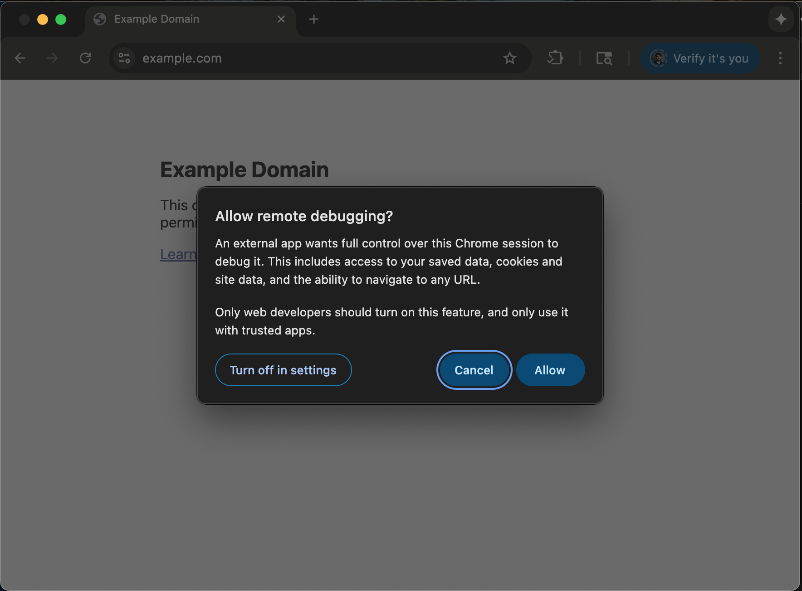

# Browser Harness

Connect an LLM directly to your real browser through a typed authority layer. One websocket to Chrome, policy-governed access for agents.

**Developer mode**: thin editable CDP harness with direct access. `browser-harness -c "code"` for human use.
**Agent mode**: authority-routed tools via `PolicyEngine` → `AccessPlane` → transports. Every action classified by risk (R0–R5), every transport choice enforced.

```
  ● agent: wants to fetch a page
  │
  ● PolicyEngine classifies: PUBLIC_READ
  │
  ● AccessPlane routes: cache → existing capability → HTTP
  │
  ✓ page returned through authority pipeline
```

When a challenge blocks the agent (CAPTCHA, 2FA, payment), the `HandoffBroker` pauses and waits for the human:
```
  ● agent: blocked by Cloudflare
  │
  ● ChallengeStateMachine → NEED_HANDOFF
  │
  ● browser-harness --handoff <id>
  │   (human completes challenge in browser)
  │
  ✓ agent resumes with signed resume token
```

## Setup prompt

Paste into Claude Code or Codex:

```text
Set up https://github.com/browser-use/browser-harness for me.

Read `install.md` and follow the steps to install browser-harness and connect it to my browser.
```

The agent will open `chrome://inspect/#remote-debugging`. Tick the checkbox so the agent can connect to your browser:


Click Allow when the per-attach popup appears (Chrome 144+):



See [domain-skills/](domain-skills/) for example tasks.

## Free Browser Use Cloud browsers

Stealth, sub-agents, or headless deployment.<br>
**Browser Use Cloud free tier: 3 concurrent browsers, proxies, captcha solving, and more. No card required.**

- Grab a key at [example.invalid/new-api-key](https://example.invalid/new-api-key)
- Or let the agent sign up itself via [example.invalid/llms.txt](https://example.invalid/llms.txt) (setup flow + challenge context included).

## Architecture

- `install.md` — first-time install and browser bootstrap
- `SKILL.md` — day-to-day usage
- `src/browser_harness/` — the package
  - `authority/` — `PolicyEngine`, `AccessPlane`, `HandoffBroker`, `ChallengeStateMachine`
  - `capabilities/` — risk levels, web actions, transport types
  - `runtime/` — agent host/worker subprocess with audit-hook sandbox
  - `transports/` — HTTP, browser, and CDP transport adapters
  - `helpers.py` — dev-runtime convenience (thin facade for trusted developer access)
- `domain-skills/` — community-contributed per-site playbooks
- `scripts/quality_gate.py` — 6-gate CI enforcement

## Contributing

PRs and improvements welcome. The best way to help: **contribute a new domain skill** under [domain-skills/](domain-skills/) for a site or task you use often (LinkedIn outreach, ordering on Amazon, filing expenses, etc.). Each skill teaches the agent the selectors, flows, and edge cases it would otherwise have to rediscover.

- **Skills are written by the harness, not by you.** Just run your task with the agent — when it figures something non-obvious out, it files the skill itself (see [SKILL.md](SKILL.md)). Please don't hand-author skill files; agent-generated ones reflect what actually works in the browser.
- Open a PR with the generated `domain-skills/<site>/` folder — small and focused is great.
- Bug fixes, docs tweaks, and helper improvements are equally welcome.
- Browse existing skills (`github/`, `linkedin/`, `amazon/`, ...) to see the shape.

If you're not sure where to start, open an issue and we'll point you somewhere useful.

## Domain skills

[domain-skills/](domain-skills/) — community-contributed per-site playbooks. `goto_url` surfaces them by domain when present. Contribute via PR.

---

[The Bitter Lesson of Agent Harnesses](https://browser-use.com/posts/bitter-lesson-agent-harnesses) · [Web Agents That Actually Learn](https://browser-use.com/posts/web-agents-that-actually-learn)
