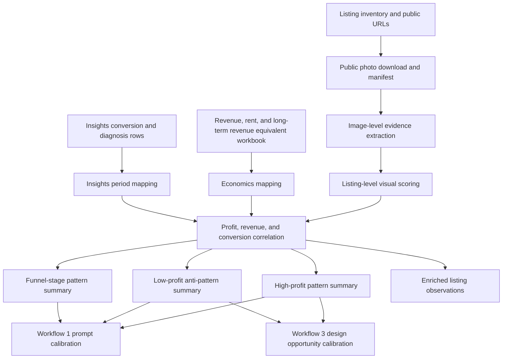

# Airbnb.com.au - Visual Revenue Workflows

Use this file when the host wants to connect listing photos, visible features,
copywriting, interior presentation, and portfolio economics. These workflows
turn visual observations into auditable prompts, profit correlations, and
low-cost design actions.

These workflows are evidence and recommendation workflows. They do not change
Airbnb listings, upload images, edit photos, or buy items. If an accepted action
will be published, log it through `decisioning.md` with rollback, review window,
and outcome metrics.

Authoritative row contracts live in `schema-visual-revenue.md`. This file owns
the workflow control path, judgement rules, scoring logic, and acceptance
criteria; the schema file owns the persistent field lists.

## Ownership

- Use this when: the user wants image-improvement prompts, photo/profit
  correlation, visual listing observations, or low-cost design/staging
  opportunities.
- Owns: visual workflow control paths, scoring logic, accuracy gates, storage
  layout, prompt/design opportunity rules, and calibration handoffs.
- Does not own: raw Airbnb public/host collection, publishable listing copy,
  durable row field lists, or implemented action tracking.
- Next hop: `schema-visual-revenue.md` for row contracts,
  `content-optimization-playbook.md` when action copy/gallery craft is needed,
  and `decisioning.md` when an accepted visual recommendation becomes an action.

## Contents

| Workflow | Goal | Primary inputs | Outputs |
|---|---|---|---|
| [Workflow 1](#workflow-1---inferior-image-improvement-prompts) | Generate one image-improvement prompt per inferior photo while preserving factual accuracy | Existing image files, listing facts, room/amenity constraints | `airbnb_image_improvement_prompt` rows |
| [Workflow 2](#workflow-2---portfolio-visual-profit-and-insights-correlation) | Examine all listings, photos, features, copy, Insights, and economics, then correlate observations with conversion, revenue, and profit | Airbnb listing inventory, public listing scrape, photo observations, Insights, Excel/CSV economics | `airbnb_visual_listing_observation`, `airbnb_visual_image_observation`, high/low pattern summaries, correlation workbook/report |
| [Workflow 3](#workflow-3---lowest-cost-highest-leverage-design-improvements) | Rank practical interior-design changes by expected conversion leverage and cost | Listing photos, listing facts, visual gaps, Workflow 2 high/low patterns, optional profit data | `airbnb_interior_design_opportunity`, `airbnb_portfolio_design_action` rows |

## Shared Principles

- Preserve source truth. Do not overwrite the original listing inventory or
  scraped source records. Save workflow outputs as timestamped sidecars keyed by
  `listing_id`.
- Prefer actual image evidence over copy-derived proxies. `photo_count` is not a
  substitute for reviewing the images.
- Separate guest-demand value from accounting effects. Profit can be driven by
  rent, owner arrangement, seasonality, or unit size; visual correlations are
  directional unless controlled for those confounders.
- Separate funnel-stage evidence from portfolio economics. Insights conversion
  tells whether the current listing problem is visibility, search-card click,
  listing-page confidence, wishlist/view friction, or economics; profit
  correlation tells which visual patterns tend to matter once the right funnel
  stage is being optimized.
- Do not fabricate property features, views, room size, amenities, fixtures,
  furniture, whitegoods, parking, or neighbourhood facts.
- Keep prompt and recommendation outputs auditable: every prompt or design
  suggestion needs evidence references, source image IDs or contact-sheet
  ordinals, and an accuracy or confidence score.

## Photo Philosophy For AI Readers

When analyzing Airbnb images, do not behave like a generic photo critic. Behave
like a conversion operator trying to move a guest through a funnel without
breaking trust.

Core frame:

```text
image quality matters only when it helps click appeal, proof, trust, or booking confidence
```

Use these mental checks before producing scores, prompts, or recommendations:

- What is the guest supposed to believe after seeing this image?
- What stage of the promise/payoff chain is this image serving: search click,
  first-five payoff, photo-tour room proof, due diligence, or arrival accuracy?
- Does the photo make the guest want to click, or does it require the full
  listing context before it becomes interesting?
- Does the image answer a real decision question: layout, sleep quality, view,
  work setup, cooking, parking, pool/gym access, cleanliness, arrival, privacy,
  or family/group fit?
- Does the image prove the right guest can actually use the stay: sleep, cook,
  sit, work, arrive, gather, and make the memory promised by the listing?
- Is the photo selling right-fit for the target archetype, or is it promoting
  amenities/capacity/theme that the home cannot comfortably deliver?
- If the listing implies group capacity, do photos prove the full system:
  sleeping arrangements, dining seats, lounge seats, kitchen gear, bathrooms,
  and outdoor/common areas?
- If the room is a bedroom, does it support the sleep-quality promise through
  bed mix, blackout/window treatment, bedside function, storage, linens, pillows,
  or review-backed host facts?
- Does theme, lead color, or a statement piece communicate a specific emotional
  promise to a segment, or does it read as generic decoration?
- Does the photo reveal maintenance, cleaning, stock, cheap-supply, or service
  risks that should become operations dependencies before image editing?
- Does the photo align with the filters and trip type the listing wants to rank
  for and earn future five-star reviews from?
- Is the image current enough to defend if a guest says the stay was not as
  pictured?
- Are apparent engagement signals from qualified guests, or are they temporary
  momentum such as artificial wishlists, friend clicks, or non-consumer traffic?
- Does it preserve the same promise created by the title, hero, price, and copy?
- Which Insights stage is this image trying to move: search-to-listing,
  listing-to-booking, qualified booking per impression, or no image-led stage?
- Is it a useful pattern break in the market, or does it look like every other
  white-wall/grey-couch listing?
- Is the hook seasonally relevant for the current booking window?
- Does it prove an under-serviced amenity or only a common feature everyone has?
- Does it advance the gallery storyline, or is it another take of the same
  scene?
- Does the image signal host effort and care through clean, specific,
  maintained, useful details?
- Does it foreground a fear trigger that would reduce confidence before the
  guest has enough proof to feel safe?
- Is this answering a question guests actually ask in reviews or messages?
- Is the photo real product photography for a stay, or only clean real-estate
  photography of an empty room?
- Does the source file have enough technical quality to edit safely, or is it
  grainy, low-resolution, screenshot-derived, crooked, unevenly lit, or cropped
  so tightly that the missing information needs a reshoot?
- What is the shot type: establishing, medium, feature/detail, product-staged,
  lifestyle, or support/disclosure?
- Would this image add buying temperature, or would it lengthen the gallery after
  the guest already has enough proof to book?
- Would an AI edit clarify a true source-visible hook, or would it manufacture a
  better product than guests will receive?

The preferred output is not "make the image nicer". The preferred output is one
of: keep and promote, keep but resequence, edit within factual anchors, reshoot
with a specific shot brief, discard, or flag a product/design gap. If the source
photo cannot honestly carry the needed conversion job, do not solve that with a
prompt.

Use AI as a skeptical assistant, not as the strategy owner. For nontrivial hero,
first-five, or edit decisions, ask the model to argue against its own
recommendation: what promise could be misleading, what guest objection remains,
what comp-set context is missing, what source fact is being inferred too
aggressively, and what would fail on arrival. Keep that disagreement in the
metadata when it affects the decision.

Do not collapse qualitative context into base fields. Beds, pool, suburb, and
price are not enough. Photos, review tone, copy, design coherence, service
signals, visible maintenance, and trust cues explain why two nearby listings with
similar inventory can perform differently.

Do not let AI invent strategy from generic STR priors. Use it after the host's
operator logic, current listing facts, comp-set evidence, reviews, old guest
messages, and photo metadata have been loaded. AI should execute and challenge
the playbook; it should not replace the playbook.

## Storage Layout

Use timestamped run directories under ignored private data:

```text
agent-workspace/domain-skills/airbnb/.private-data/photo-observations/{run_id}/
  photo_manifest.json
  visual_observations.json
  contact-sheets/{listing_id}.jpg
  images/{listing_id}/{ordinal}_{photo_key}.jpg

agent-workspace/domain-skills/airbnb/.private-data/image-improvement-prompts/{run_id}.json
agent-workspace/domain-skills/airbnb/.private-data/interior-design-opportunities/{run_id}.json
outputs/{run_id}/visual_profit_correlation.xlsx
```

When enriching listing data, write an additive copy such as
`airbnb-live-listings-...-with-photo-observations.json`. Do not mutate the
canonical scraped listing file in place.

## Workflow 1 - Inferior Image Improvement Prompts

Goal: take existing inferior listing images, such as iPhone photos, and produce
one image-model prompt per image that improves commercial quality while keeping
the image at least 70% factually accurate to the source.

The host's "do not reduce accuracy by more than 30%" requirement maps to:

```text
accuracy_retention_score >= 70/100
```

If an improvement requires changing material property facts, create a reshoot or
staging recommendation instead of a generative edit prompt.

### Portfolio-Calibrated Priorities

Use the latest portfolio correlation workbook, when available, to choose the
class of problem the prompt should inspect. Do not fit the prompt to one
coefficient, one unit, one suburb, or one historical workbook. Also use the
latest Insights conversion diagnosis, when available, to decide whether image
editing is the right lever at all. In the MSA real-photo calibration run, the
strongest positive directional signals were:

| Signal | Directional correlation to profit | Prompt implication |
|---|---:|---|
| Computed sharpness proxy | `0.6890` | prioritize clarity, denoise, sharpening, lens correction, and crisp subject edges |
| Interior design score | `0.4722` | make the existing room read more polished, styled, and intentional without inventing furnishings |
| Composition score | `0.3784` | straighten verticals, crop to the room's strongest line, reduce dead space, and make the subject instantly legible |
| Visual brightness score | `0.3427` | brighten plausibly, correct white balance, and recover shadows without changing aspect or real light source |
| Hero strength | `0.2205` | make the image work as a thumbnail by emphasizing the actual booking hook |

Low-profit anti-patterns seen in the same run:

- hero image is a TV/detail shot rather than a property hook
- gallery feels functional rather than aspirational
- interiors look basic, dated, dim, or carpet-heavy
- first-five sequence includes exterior/local/common-area filler before the
  property is proven
- amenity proof is weak or absent where amenities are claimed
- compact bedrooms or narrow rooms are shown without a clear layout/readability
  strategy

These are prompt priorities, not permission to fabricate. If an image cannot
honestly show the missing value, emit a `reshoot_or_resequence_needed` action
instead of a heavy edit prompt.

### Anti-Overfit Correlation Rules

Treat correlation as a set of strategic priors, not a template. The useful
finding from the prior analysis was not "make every listing brighter" or "copy
the top performer." The useful finding was that better-performing listings tended
to make the source-visible product easier to believe: clearer, sharper,
straighter, more intentionally presented, better sequenced, and more able to
prove the stay promise without filler.

Before any image edit prompt, run a transfer check:

```text
pattern_transfer_check:
- Does this pattern solve the active Insights stage for this listing?
- Does it fit the target guest job, season, comp set, and price position?
- Is the value source-visible in this exact photo?
- Would the edit preserve arrival accuracy and review trust?
- Is there a stronger non-edit action: resequence, reshoot, staging, copy, rules,
  price, or operations?
```

Use correlation patterns at three levels:

| Level | How to use it | Overfit risk |
|---|---|---|
| Durable visual craft | Clarity, straightness, truthful colour, subject hierarchy, and crop safety usually help because they reduce cognitive load | Low, unless the edit becomes HDR, fake, or over-polished |
| Strategic pattern class | First-five strength, source-visible proof, product-staged use cases, and host-effort signals should be applied only when they match the guest segment and funnel stage | Medium, because a pattern can be useful in one market but not this listing |
| Portfolio-specific coefficient | Exact correlations, ranks, and top/bottom quartile deltas are hypothesis evidence only | High, especially with small samples, rent effects, seasonality, comp drift, and simultaneous listing changes |

If strategic judgement and correlation conflict, strategic judgement wins. A
real but small correlation should not override source truth, guest fit,
seasonality, comp-set positioning, or a clear Insights-stage diagnosis. Record
the conflict in `overfit_risk_flags` or `strategic_override_notes` instead of
forcing the image into the correlated pattern.

Interpret the calibration this way when writing the actual image prompt:

- `avg_image_sharpness_proxy` was the strongest positive signal, so the prompt
  should almost always improve clarity before trying more subjective styling.
- `interior_design`, `composition`, and human-scored `brightness_visual` moved
  with high profit, so the prompt should make the existing room feel intentional,
  straight, clean, and legible.
- computed raw brightness was slightly negative while human-scored brightness was
  positive, so do not simply make images brighter. Prefer balanced exposure,
  accurate colour, recovered shadows, and preserved window/view detail.
- view and amenity proof were valuable in individual high-profit listings, but
  their simple correlations were negative in this small workbook. Treat them as
  source-visible hooks to preserve or clarify, not generic things to add or
  overemphasize.
- high-profit galleries usually had a clear first-five story: strong hero,
  real view/balcony or amenity proof when present, crisp bedrooms/living spaces,
  and little filler before the property value was proven.

Use this default prompt weighting as a starting prior unless a newer workbook
and strategic transfer check override it:

| Prompt priority | Weight | What the prompt should do |
|---|---:|---|
| Clarity, sharpness, denoise, lens correction | 30 | make the image crisp and professional without artificial edge halos |
| Composition and subject hierarchy | 20 | straighten, crop, reduce dead space, and make the booking hook obvious |
| Interior polish from existing facts | 20 | make real finishes, styling, surfaces, and room presentation read cleaner and more intentional |
| Plausible light and colour | 15 | improve white balance, shadows, and contrast without overexposure or fake sunlight |
| Source-visible revenue hook | 10 | preserve or clarify real balcony, view, courtyard, pool, gym, parking, capacity, or architectural charm |
| Resequence/reshoot recommendation | 5 | flag images that are structurally bad hero candidates instead of over-editing them |

Use the workbook examples to select the prompt intent before writing the prompt:

| Pattern seen in source image or current gallery | Profit lesson | Prompt intent |
|---|---|---|
| crisp room photo with clear bed/living/kitchen/bathroom proof | high-profit listings had stronger sharpness, composition, and room proof | `crisp_core_room_upgrade` |
| real skyline, terrace, balcony, courtyard, garden, or architectural charm | strong when it is real and appears early enough in the gallery | `real_hook_clarification` |
| pool, gym, sauna, tennis, or parking is genuinely visible | useful as proof, but not a substitute for strong interiors | `amenity_proof_clarification` |
| image could be hero or first-five but the subject is unclear | hero strength and first-five strength were higher in the top quartile | `hero_hook_upgrade` |
| room is compact, narrow, or plain | low performers often made small rooms feel worse through weak angle/crop | `compact_room_readability` |
| interior feels dim, dated, basic, carpet-heavy, or flat | this was the clearest recurring low-profit interior anti-pattern | `dated_basic_interior_cleanup` |
| TV, detail, screenshot, duplicated view, local/lifestyle, exterior, or common-area filler | low-profit pattern unless it proves a specific useful fact | `support_image_or_resequence` |
| missing hook would require adding a view, balcony, amenity, furniture, or renovation | fabrication risk is higher than conversion upside | `reshoot_or_no_safe_prompt` |

The prompt must improve the selected intent, not every possible attribute.
Example: a dim bedroom should not receive a balcony/view prompt; a balcony shot
should not receive fake interior styling; a TV/detail hero should usually receive
a demotion/resequence recommendation rather than a hero edit.

Conversion-calibrated prompt selection:

| Insights stage | What image work is allowed to lead |
|---|---|
| `search_card_click` | Hero/alternate-hero crop, thumbnail hook, title-photo promise alignment, seasonal hook, and comp-set pattern break |
| `listing_page_conversion` | First-five proof, room-hero proof, sleep/kitchen/capacity/amenity trust, and objection-reducing edits |
| `wishlist_or_view_friction` | Resequence or proof clarification only when a specific trust defect is visible; otherwise route to price, rules, fees, cancellation, or segment-fit review |
| `visibility` | No image prompt as primary action unless the photo proves a missing filter/relevance claim |
| `economics_not_content` | Preserve content and route to ADR, LOS, occupancy, rent, or channel economics unless image evidence contradicts the stage diagnosis |

If the image is not tied to an Insights stage or expected metric, mark the prompt
`exploratory_visual_quality` and keep confidence lower than a stage-backed prompt.

### Inputs

Required:

- `listing_id`
- source image path or URL
- source image hash
- source image ordinal or filename
- room/area label when known
- known listing facts: bedrooms, bathrooms, guest cap, parking, balcony/view,
  pool/gym/sauna, workspace, laundry, pet-friendly status, dining seats, lounge
  seats, bed sizes, blackout/window treatment, and stocked kitchen proof
- host constraints: what must not be shown, privacy constraints, brand style

Optional but useful:

- target guest segment
- guest-archetype fit notes and right-fit risks
- known sleep-quality facts from host inventory or reviews
- known capacity-fit facts for dining, lounge, kitchen, bathrooms, outdoor use,
  and sleeping arrangements
- theme, lead-color, or statement-piece intent when the design is meant to sell
  an emotional promise
- known maintenance, cleaning, supply, or service risks from reviews/messages
- target filters, trip types, and review-language goals when the photo is meant
  to improve search relevance
- photo taken date, gallery change history, recent condition evidence, and any
  post-clean photo/video proof when "as pictured" risk matters
- known engagement quality notes separating real guests from artificial
  wishlists, friend clicks, or low-intent traffic
- latest `airbnb_insights_conversion` row, `airbnb_conversion_diagnosis` row, and
  any Insights-vs-listing correlation summary for the same period
- current hero/first-five order
- comp-set visual patterns
- current search-card screenshots or notes showing the market default pattern
- current season, event window, and target stay type when seasonality affects
  guest demand
- repeated guest questions from reviews, old messages, house-manual gaps, or
  support tickets
- latest high-profit and low-profit pattern summary
- correlation workbook path and run ID when the prompt is calibrated from a
  portfolio analysis
- accepted colour palette or styling references
- known defects from visual review

### Material Accuracy Rules

Allowed edits usually include:

- exposure, white balance, contrast, dehaze, denoise, sharpening, lens
  correction, vertical straightening, crop, glare reduction, and mild shadow
  recovery
- removing temporary clutter that is not a material amenity or fixture
- making linen, towels, cushions, or removable styling look neater when those
  items are already present
- replacing a black TV reflection with a neutral dark screen
- improving sky/window exposure only when the real view remains the same
- adding no more than light editorial polish to surfaces, walls, and floors

Forbidden edits include:

- adding or removing windows, doors, walls, balconies, courtyards, pools, gyms,
  parking spaces, city/water views, landmarks, appliances, beds, desks, or rooms
- making a room materially larger, brighter than plausible, more open-plan, or
  higher-floor than it is
- changing permanent finishes such as flooring, benchtops, cabinetry, tiles,
  bathroom fixtures, built-ins, or view direction
- adding luxury furniture, artwork, plants, appliances, or decor that will not
  actually be present for guests
- hiding safety/access constraints, stairs, tight layouts, worn finishes, or
  neighbouring-building view obstructions
- inventing labels, logos, signs, parking bay numbers, Wi-Fi speed tests, or
  floor-plan facts
- inventing sleep-comfort proof, blackout curtains, extra seating, larger dining
  capacity, stocked kitchen tools, service quality, maintenance condition, or a
  coherent theme that is not source-visible and true

### Prompt Generation Steps

1. Create an image observation record.

```text
image_id
listing_id
source_path
source_hash
photo_ordinal
room_or_area
calibration_run_id
source_capture_quality_flags
shot_type
product_photography_staging_notes
eye_candy_or_statement_piece_basis
hero_crop_control_notes
promise_payoff_stage
seasonal_relevance
comp_set_pattern_basis
pattern_break_basis
under_serviced_amenity_basis
first_five_collage_role
room_hero_candidate_flag
room_amenity_declaration_basis
storyline_contribution
guest_message_question_basis
kitchen_proof_package_status
guest_archetype_fit_basis
experience_fit_proof_status
sleep_quality_proof_status
capacity_fit_proof_status
theme_emotional_promise_basis
maintenance_review_risk_flags
service_signal_basis
query_filter_alignment_basis
review_relevance_basis
photo_currency_status
post_clean_condition_evidence_status
as_pictured_risk_flags
momentum_signal_caution_flags
perception_of_effort_score_0_100
gallery_fatigue_risk
visual_tone_sequence_notes
observed_hero_test_data
insights_period_start
insights_period_end
insights_metric_basis
insights_funnel_stage
search_to_listing_delta_basis
listing_to_booking_delta_basis
wishlist_to_booking_friction_basis
conversion_correlation_basis
conversion_stage_priority
expected_metric_to_move
conversion_confounder_flags
insights_confidence
correlation_generalization_basis
pattern_transfer_check
strategic_fit_basis
overfit_risk_flags
strategic_override_notes
fear_trigger_risk_flags
current_quality_issues
commercial_goal
guest_question_answered
objection_reduced
trust_signal_type
proof_strength_0_100
title_photo_promise_alignment
post_click_trust_surface_flags
thumbnail_hook_score_0_100
mobile_crop_score_0_100
misleading_risk_flags
profit_pattern_basis
source_image_evidence_summary
image_profit_pattern_class
primary_prompt_intent
high_profit_pattern_to_strengthen
low_profit_antipattern_to_reduce
source_visible_revenue_hooks
missing_or_unprovable_hooks
factual_anchors
forbidden_changes
edit_vs_reshoot_decision
reshoot_shot_brief
qualitative_context_notes
ai_skepticism_review_notes
candidate_prompt_score_0_100
recommended_gallery_action
accuracy_retention_floor = 70
```

2. Classify the image problem.

Use these classes:

```text
dark_or_flat
wrong_white_balance
crooked_verticals
wide_angle_distortion
glare_or_reflection
clutter_or_mess
poor_crop
weak_hero_readability
tv_or_detail_as_hero
generic_common_area_or_local_filler
unclear_layout
compact_room_needs_layout_clarity
understyled_but_accurate
functional_not_aspirational
dated_or_basic_finish
weak_amenity_proof
weak_view_or_balcony_proof
off_season_hook
weak_under_serviced_amenity_proof
missing_ready_to_cook_kitchen_proof
weak_guest_archetype_fit
weak_experience_fit_proof
weak_sleep_quality_proof
weak_capacity_fit_proof
unclear_theme_or_emotional_promise
maintenance_or_review_risk_visible
weak_service_signal
weak_query_filter_alignment
weak_review_relevance
stale_or_unverified_photo_currency
missing_post_clean_condition_evidence
as_pictured_dispute_risk
artificial_or_low_intent_momentum_signal
weak_perception_of_effort
unanswered_guest_message_question
real_estate_photo_not_product_photo
unstaged_core_use_case
weak_eye_candy_or_statement_piece
bad_hero_crop
gallery_fatigue_risk
jarring_visual_tone_sequence
observed_ctr_underperformer
overbright_or_hdr_fake
plain_bedroom_or_basic_interior
repetitive_or_low_value_detail
diluted_by_location_lifestyle
weak_capacity_proof
low_resolution_or_noise
```

3. Extract source evidence and choose one primary prompt intent.

Do not write the image prompt until these fields are explicit:

```text
source_image_evidence_summary:
- room_or_area visible
- visible fixed features
- visible removable contents
- visible view/outdoor/amenity proof
- visible constraints or defects
- current gallery position risk
- comp-set pattern followed or broken
- seasonal relevance of the hook
- under-serviced amenity basis, if claimed
- first-five collage role or photo-tour room-hero role
- storyline contribution or redundancy
- guest-message/review question being answered
- ready-to-cook kitchen proof status when cooking matters
- perceived host effort and care signals
- title/photo promise alignment
- post-click trust surface risk from fees, rules, messages, or copy
- source capture defects that make the image a reshoot/recover/crop candidate
  before AI editing
- staging and eye-candy basis that proves the stay is easy, expressive, or
  memorable
- hero crop-control risk for search card, mobile, and desktop first-five display
- gallery fatigue and mood-sequence risk
- observed hero-test data when available, separated into exposure,
  click-through, booking, and review outcome signals
- Insights-vs-listing evidence when available: reporting period, search-to-listing
  gap, listing-to-booking gap, wishlist/view friction, target metric, and
  confounders
- correlation transfer evidence: which prior pattern class applies, why this
  listing/photo is similar enough to use it, where the analogy breaks, and what
  strategic judgement overrides the coefficient
- guest objection reduced or left unanswered
- trust risk from stale, inconsistent, or too-good-to-be-true presentation
- fear-trigger risk from foregrounding true but confidence-reducing attributes

image_profit_pattern_class:
- high_profit_signal_present
- low_profit_antipattern_present
- mixed_signal
- no_safe_revenue_signal

primary_prompt_intent:
- crisp_core_room_upgrade
- real_hook_clarification
- amenity_proof_clarification
- hero_hook_upgrade
- compact_room_readability
- dated_basic_interior_cleanup
- support_image_or_resequence
- reshoot_or_no_safe_prompt
```

Choose only one primary intent. Secondary edits are allowed only when they do not
dilute the primary intent or increase factual risk.

4. Assign the image improvement strategy.

Use the highest applicable strategy:

| Image role | Best strategy |
|---|---|
| Candidate hero or first-five image | optimize truthful thumbnail hook, mobile crop, booking hook, trust proof, composition, straightness, plausible brightness, and crispness |
| Bedroom/living/kitchen/bathroom proof | improve crispness, interior polish, layout readability, colour fidelity, clean presentation, and the exact guest question the photo answers |
| View/balcony/amenity proof | clarify the real view or amenity only if it is actually present; preserve obstructions and do not invent skyline, pool, gym, parking, or outdoor area |
| Exterior/local/common-area filler | usually recommend resequencing or replacement, not heavy enhancement; use only after core property value is proven |
| TV/detail/clutter image | demote from hero/first-five and generate a prompt only if it still proves a useful property fact |

5. Score whether a prompt is actually worth generating.

Use the score to decide whether the row gets an image edit prompt,
`resequence_needed`, `reshoot_needed`, or `no_safe_prompt`.

```text
candidate_prompt_score_0_100 =
  30 * clarity_fixable
+ 20 * composition_fixable
+ 20 * interior_polish_fixable
+ 15 * truthful_thumbnail_hook_fixable
+ 10 * light_colour_fixable
+ 10 * source_visible_revenue_hook_clarifiable
+  5 * supports_first_five_story
- 30 * requires_fabricating_missing_hook
- 25 * creates_title_photo_tone_shift
- 20 * structurally_bad_hero_candidate
- 15 * accuracy_risk_high
- 15 * overfit_risk_high
```

Generate a prompt when `candidate_prompt_score_0_100 >= 45`. Below that, prefer
`reshoot_needed`, `resequence_needed`, or `no_safe_prompt` with the reason.
The score is a decision aid, not a command. Cap the final recommendation at
`human_review_required` when the only reason to edit is portfolio correlation and
the transfer check cannot explain why that pattern belongs on this listing.

Use these gallery actions:

```text
edit_and_keep_position
edit_but_demote_from_first_five
edit_as_supporting_proof
resequence_needed
reshoot_needed
no_safe_prompt
```

Use `edit_vs_reshoot_decision` to explain the action. Choose `edit` only when
the source image already contains the room, view, amenity, layout, or trust proof
that the prompt will clarify. Choose `reshoot` when the missing conversion value
is absent from the source, the room cannot be understood, the image is stale
against the current gallery, or the desired result would require AI to add or
change a material fact. Choose `resequence` when the image is truthful but
belongs later, and `discard` when it creates more doubt than proof.

6. Generate one prompt per image.

When `photo_analysis.json` or `photo_analysis.csv` exists for the same source
photo, use it as the prompt source. Do not recaption from filenames. Pull
`caption`, `room_or_area`, `visible_subjects`, `visible_amenities`,
`view_type`, `promise_payoff_stage`, `seasonal_relevance`,
`comp_set_pattern_basis`, `pattern_break_basis`,
`under_serviced_amenity_basis`, `first_five_collage_role`,
`room_hero_candidate_flag`, `room_amenity_declaration_basis`,
`storyline_contribution`, `guest_message_question_basis`,
`kitchen_proof_package_status`,
`guest_archetype_fit_basis`, `experience_fit_proof_status`,
`sleep_quality_proof_status`, `capacity_fit_proof_status`,
`theme_emotional_promise_basis`, `maintenance_review_risk_flags`,
`service_signal_basis`, `query_filter_alignment_basis`,
`review_relevance_basis`, `photo_currency_status`,
`post_clean_condition_evidence_status`, `as_pictured_risk_flags`,
`momentum_signal_caution_flags`, `perception_of_effort_score_0_100`,
`source_capture_quality_flags`, `shot_type`,
`product_photography_staging_notes`, `eye_candy_or_statement_piece_basis`,
`hero_crop_control_notes`, `gallery_fatigue_risk`,
`visual_tone_sequence_notes`, `observed_hero_test_data`,
`insights_metric_basis`, `insights_funnel_stage`,
`conversion_correlation_basis`, `conversion_stage_priority`,
`expected_metric_to_move`, `conversion_confounder_flags`,
`insights_confidence`, `correlation_generalization_basis`,
`pattern_transfer_check`, `strategic_fit_basis`, `overfit_risk_flags`,
`strategic_override_notes`, `fear_trigger_risk_flags`, `factual_anchors`,
`allowed_edit_types`,
`forbidden_edit_types`, `accuracy_constraints`, `guest_question_answered`,
`objection_reduced`, `trust_signal_type`, `proof_strength_0_100`,
`title_photo_promise_alignment`, `post_click_trust_surface_flags`,
`misleading_risk_flags`, `qualitative_context_notes`,
`edit_vs_reshoot_decision`, and `reshoot_shot_brief` into the prompt. If those
fields are missing, create or enrich the photo analysis metadata before
generating edit prompts.

Prompt template:

```text
Improve this real Airbnb listing photo for commercial presentation while
preserving factual accuracy. Keep the same room, layout, window positions,
view, fixtures, finishes, furniture, appliances, amenities, and spatial scale.

Portfolio-calibrated objective from {calibration_run_id}:
- source evidence summary: {source_image_evidence_summary}
- promise/payoff stage: {promise_payoff_stage}
- seasonal relevance: {seasonal_relevance}
- comp-set pattern basis: {comp_set_pattern_basis}
- truthful pattern break: {pattern_break_basis}
- under-serviced amenity basis: {under_serviced_amenity_basis}
- first-five collage role: {first_five_collage_role}
- room-hero flag: {room_hero_candidate_flag}
- room amenity declaration basis: {room_amenity_declaration_basis}
- gallery storyline contribution: {storyline_contribution}
- guest-message/review question basis: {guest_message_question_basis}
- kitchen proof package status: {kitchen_proof_package_status}
- guest-archetype fit basis: {guest_archetype_fit_basis}
- experience-fit proof status: {experience_fit_proof_status}
- sleep-quality proof status: {sleep_quality_proof_status}
- capacity-fit proof status: {capacity_fit_proof_status}
- theme/emotional-promise basis: {theme_emotional_promise_basis}
- maintenance/review-risk flags: {maintenance_review_risk_flags}
- service-signal basis: {service_signal_basis}
- query/filter alignment basis: {query_filter_alignment_basis}
- review-relevance basis: {review_relevance_basis}
- photo-currency status: {photo_currency_status}
- post-clean condition evidence status: {post_clean_condition_evidence_status}
- as-pictured risk flags: {as_pictured_risk_flags}
- momentum-signal caution flags: {momentum_signal_caution_flags}
- perceived effort score: {perception_of_effort_score_0_100}
- source capture quality flags: {source_capture_quality_flags}
- shot type: {shot_type}
- product-photography staging notes: {product_photography_staging_notes}
- eye candy or statement-piece basis: {eye_candy_or_statement_piece_basis}
- hero crop-control notes: {hero_crop_control_notes}
- gallery fatigue risk: {gallery_fatigue_risk}
- visual tone sequence notes: {visual_tone_sequence_notes}
- observed hero-test data: {observed_hero_test_data}
- guest decision question answered: {guest_question_answered}
- objection reduced: {objection_reduced}
- trust signal or trust risk: {trust_signal_type}
- title/photo promise alignment: {title_photo_promise_alignment}
- post-click trust surface flags: {post_click_trust_surface_flags}
- fear-trigger risk flags: {fear_trigger_risk_flags}
- misleading risk flags: {misleading_risk_flags}
- qualitative context notes: {qualitative_context_notes}
- image profit pattern class: {image_profit_pattern_class}
- correlation generalization basis: {correlation_generalization_basis}
- pattern transfer check: {pattern_transfer_check}
- strategic fit basis: {strategic_fit_basis}
- overfit risk flags: {overfit_risk_flags}
- strategic override notes: {strategic_override_notes}
- primary prompt intent: {primary_prompt_intent}
- strengthen this high-profit pattern: {high_profit_pattern_to_strengthen}
- reduce this low-profit anti-pattern: {low_profit_antipattern_to_reduce}
- follow this priority order: crisp clarity first, then composition and subject
  hierarchy, then existing-room polish, then plausible light and colour, then
  source-visible revenue hooks
- use correlation patterns only as directional priors; do not copy a prior top
  performer, chase a coefficient, or force this image into a portfolio pattern
  unless the transfer check says the guest job, funnel stage, comp set, season,
  and source-visible facts fit
- do not force view, balcony, pool, gym, parking, workspace, architectural charm,
  or luxury cues into the image unless the source image already proves them
- do not create a tone shift between title, hero, first five, copy, and real
  arrival experience
- if this image is a weak hero because it is a TV/detail/common-area/location
  filler shot, improve only as a support image and recommend resequencing rather
  than trying to make it the main hook
- if the correct recommendation is `{edit_vs_reshoot_decision}` and that value
  is not `edit`, do not produce an overreaching image edit; explain the reshoot,
  resequence, or discard action instead

Skeptical review:
- argue against this prompt before finalizing it
- list any missing comp-set, photo-tour, arrival-accuracy, or trust evidence
- list any missing seasonality, room-amenity, kitchen-proof, or old-message
  evidence
- list any source-visible fact the prompt might be over-inferring
- list any way the correlation pattern could be overfit to the prior workbook,
  wrong for this listing's target guest, wrong for this season, or better solved
  by resequence/reshoot/staging/copy/rules/price/operations
- if the objection is material, return `no_safe_prompt`,
  `reshoot_or_resequence_needed`, or `human_review_required`

Intent-specific instructions:
- if `crisp_core_room_upgrade`: prioritize denoise, deblur, straight verticals,
  clean crop, accurate colour, and clear room function
- if `hero_hook_upgrade`: make the actual source-visible booking hook legible in
  thumbnail form without changing room scale, view, or amenities
- if `real_hook_clarification`: preserve the exact real view/outdoor/architectural
  hook and improve exposure/contrast only enough to make it readable
- if `amenity_proof_clarification`: make the real amenity proof clearer, but keep
  signage, equipment, pool/gym layout, access limits, and surrounding context true
- if `compact_room_readability`: use straight lines and a truthful crop to make
  layout understandable; do not widen, stretch, remove constraints, or imply more
  usable space
- if `dated_basic_interior_cleanup`: improve cleanliness, colour balance, glare,
  wrinkles, shadows, and presentation of existing finishes; do not renovate,
  replace carpet, hide dated fixtures, or add styling
- if `support_image_or_resequence`: improve only basic clarity and recommend a
  lower gallery position unless it proves a specific source-visible fact

Image role:
- {image_role}

Recommended gallery action:
- {recommended_gallery_action}

Primary improvements:
- {issue_specific_edits}

Keep these source-visible revenue hooks prominent:
- {source_visible_revenue_hooks}

Do not chase these missing or unprovable hooks:
- {missing_or_unprovable_hooks}

Factual anchors that must remain unchanged:
- {factual_anchors}

Do not:
- add, remove, replace, or materially alter any permanent property feature
- make the room look materially larger or more luxurious than the source
- invent views, amenities, furniture, appliances, decor, signage, or lighting
- replace carpet, flooring, cabinetry, benchtops, tiles, bathroom fixtures,
  windows, doors, balcony rails, or building surroundings
- hide constraints that a guest would notice on arrival
- hide real neighbouring-building obstructions, compact room scale, dated
  finishes, or access constraints

Accuracy requirement:
- retain at least 70/100 factual accuracy to the source image
- if an edit would reduce accuracy below that, leave the source detail unchanged

Output style:
- natural Airbnb product photography
- balanced, plausible exposure with preserved highlights and window detail
- straight verticals
- accurate colours
- crisp but not artificial sharpness
- warmer and more inviting only within the real lighting and finishes
- professional but not HDR, CGI, showroom, luxury-renovated, or over-staged
```

7. Generate a negative prompt.

```text
No new furniture, no new decor, no changed layout, no enlarged windows, no
changed view, no changed flooring, no changed cabinetry, no changed bathroom
fixtures, no fake balcony, no fake pool, no fake gym, no luxury renovation,
no fake parking, no fake workspace, no artificial sunlight that changes the real
aspect, no text overlays, no removing permanent obstructions, no making a
compact room look materially larger, no fake high floor, no changed carpet,
no hidden neighbouring buildings, no over-bright HDR look, no plastic CGI
surfaces, no fake linen or styling that will not be present for guests.
```

8. Add an accuracy check prompt for the edited result.

```text
Compare the edited image against the source. Return JSON with:
accuracy_retention_score_0_100
material_changes_detected
allowed_improvements_detected
high_profit_signal_improvements_detected
low_profit_antipatterns_reduced
prompt_priority_followed
correlation_pattern_transfer_valid
overfit_risk_flags
strategic_fit_preserved
strategic_override_respected
primary_prompt_intent_preserved
unproven_hooks_introduced
commercial_quality_delta_0_100
recommended_gallery_action_still_valid
guest_misrepresentation_risk
title_photo_promise_alignment_preserved
guest_question_still_answered
objection_still_reduced
storyline_contribution_preserved
seasonal_hook_still_valid
under_serviced_amenity_proof_preserved
kitchen_proof_still_truthful
guest_archetype_fit_preserved
experience_fit_proof_preserved
sleep_quality_proof_still_truthful
capacity_fit_proof_still_truthful
theme_emotional_promise_preserved
maintenance_review_risk_not_hidden
service_signal_not_invented
query_filter_alignment_preserved
review_relevance_not_weakened
photo_currency_not_misrepresented
post_clean_condition_evidence_not_invented
as_pictured_risk_not_hidden
momentum_signal_not_overstated
perception_of_effort_preserved
fear_trigger_risk_increased
new_trust_risks_introduced
pass_fail

Fail if accuracy_retention_score_0_100 < 70 or if any material property fact
was added, removed, or changed.

Also fail if the edit creates a false high-profit cue, including fake view,
fake balcony/outdoor space, fake pool/gym/parking, fake workspace, materially
larger room scale, luxury finishes not present, or furniture/decor that will not
be present for guests.

Also fail if the edit creates a title/photo tone shift, makes a stale photo look
current when the room has materially changed, or weakens the proof that the
selected guest question is actually answered.

Also fail if the edit removes the photo's real pattern-break basis, makes the
first-five collage or room-tour hero less coherent, increases a fear trigger, or
turns a support photo into a fake hero.

Also fail if the edit turns an off-season or common amenity into the implied
primary demand driver, weakens ready-to-cook proof, removes useful host-effort
signals, or answers a guest-message question less truthfully than the source.

Also fail if the edit overfits the prior correlation analysis: copying a
portfolio-specific look that does not fit the target guest, improving a metric
proxy while weakening the actual stay proof, or applying a high-profit pattern
without source-visible evidence and a valid transfer check.

Also fail if the edit invents or exaggerates sleep quality, blackout/window
treatment, extra beds, dining seats, lounge seats, kitchen stock, bathroom
capacity, outdoor/common-area usability, service quality, cleanliness,
maintenance condition, or theme coherence.

Also fail if the edit makes a stale image look current, hides an "as pictured"
risk, fabricates post-clean condition evidence, attracts a filter/trip type the
listing cannot satisfy, or makes artificial engagement look like qualified guest
intent.

Also fail if the source image is grainy, too low-resolution, screenshot-derived,
heavily compressed, materially underexposed, or overcropped and the prompt would
pretend missing image information exists. Prefer original-file recovery,
crop/level correction, resequence, or reshoot.

Also fail if the image is clean real-estate photography but not stay product
photography and the prompt would invent props, appliances, styling, or eye candy
that is not source-visible and guaranteed to be present for guests.

Also fail if the image is merely brighter but less accurate, over-HDR, less
sharp, less natural, or more misleading about room size, finish quality, view,
amenity access, or first-five suitability.
```

### Output Row

Persist one `airbnb_image_improvement_prompt` row per source image prompt
candidate. The authoritative field list is in `schema-visual-revenue.md`.

### Acceptance Criteria

- Every inferior image receives one prompt or an explicit `no_safe_prompt`
  reason.
- Every prompt includes factual anchors and forbidden changes.
- Every prompt carries the guest question answered, objection reduced, title/photo
  promise alignment, and misleading-risk fields from `photo_analysis`.
- Hero, first-five, photo-tour room-hero, and AI-edit decisions preserve
  comp-set pattern basis, promise/payoff stage, storyline contribution,
  fear-trigger flags, guest-archetype fit, experience-fit proof,
  sleep-quality proof, capacity-fit proof, theme/emotional-promise basis,
  maintenance/review-risk flags, service-signal basis, query/filter alignment,
  review relevance, photo-currency status, as-pictured risk, momentum-signal
  cautions, and any skeptical review notes.
- Prompts do not authorize material changes to property facts.
- Every prompt states which high-profit visual signal it is trying to improve
  and which low-profit anti-pattern it is trying to reduce.
- Images that cannot safely improve a high-value signal are marked
  `reshoot_or_resequence_needed` instead of receiving an overreaching prompt.
- Prompts prioritize sharpness, composition, interior polish, and plausible
  light before view/amenity amplification unless the source visibly proves the
  view or amenity.
- Every generated prompt has exactly one primary prompt intent, grounded in
  source-visible evidence and the high/low profit pattern analysis.
- Weak hero candidates such as TV/detail/common-area/location filler shots get a
  gallery-action recommendation, not a fake hero prompt.
- Compact, dated, basic, or dim rooms are improved through truthful readability
  and presentation, not virtual renovation.
- Reshoot, resequence, or discard decisions are explicit and are not converted
  into AI edit prompts just because editing is technically possible.
- The generated check prompt can fail an over-edited image.
- Outputs are saved to `.private-data/image-improvement-prompts/{run_id}.json`.

## Workflow 2 - Portfolio Visual Profit And Insights Correlation

Goal: take all current Airbnb listings plus an Excel or CSV file containing
revenue, rent, profit, or long-term equivalent revenue, plus Airbnb Insights
conversion exports when available, examine listings, features, copy, and real
photos, save observations to listing files, and determine directional
correlations.

This is the repeatable version of the real-photo profit workflow and the
Insights-vs-listing correlation analysis. Profit calibration tells which visual
patterns are associated with portfolio economics. Insights calibration tells
which part of the guest funnel a content change is allowed to target.

The output should not be only a correlation workbook. It must also create a
reusable calibration layer that feeds:

- Workflow 1 image-improvement prompts
- Workflow 3 interior-design opportunity scoring
- listing-level visual observation files
- high-profit and low-profit pattern summaries for future candidate scoring

The thread's current MSA calibration showed the practical lesson: high profit
was more consistently associated with crispness, composition, interior polish,
first-five strength, and believable presentation than with blindly emphasizing
views or amenities. Views, balconies, pool, gym, parking, courtyard, and
architectural charm remain important, but only when they are source-visible,
accurately photographed, and sequenced before weaker filler.

### Inputs

Required:

- latest complete `airbnb-live-listings-*.json`
- public listing URLs for each active listing
- economics workbook or CSV with a stable join key such as unit code, listing
  nickname, address unit prefix, listing ID, or host nickname

Optional:

- latest own-public listing scrape with title, raw copy, amenities, reviews,
  and search appearance
- latest `airbnb_insights_conversion`, `airbnb_conversion_diagnosis`, and
  `airbnb_photo_product_gap_audit` rows for the same listing period
- reservation, revenue, owner statement, rent, and cost exports
- manual mapping overrides when spreadsheet unit codes do not match listing
  nicknames
- existing Workflow 1 image prompt rows for inferior images
- existing Workflow 3 design recommendations and completed action outcomes
- previous calibration workbook and pattern summaries, to compare whether
  signals persisted or changed

### Control Path



Do not skip pages or photos that are available in the public gallery. If a photo
cannot be downloaded or reviewed, record the blocker at image level and keep the
listing in the cohort with coverage flags.

### Collection Steps

1. Validate source completeness.

Required gates:

- listing inventory is not marked `partial_run`
- active listing count is known
- public listing URLs are present
- economics file has at least one join key and one target metric

2. Download public listing photos.

For each listing:

- fetch the public listing page
- extract real `a0.muscache.com` listing image URLs
- include normal, `prohost-api`, numeric `Hosting-*`, and encoded `Hosting-*`
  gallery path variants
- deduplicate by original image path
- download bounded-size copies for local review
- compute deterministic image metrics: brightness, aspect ratio, sharpness
  proxy, dimensions
- create a contact sheet containing all downloaded images in gallery order

Persist:

```text
photo_manifest.json
images/{listing_id}/{ordinal}_{photo_key}.jpg
contact-sheets/{listing_id}.jpg
```

3. Create image-level photo analysis metadata.

Before creating any shareable filenames, persist the visual labels and analysis
as metadata. Filenames are an export view of this metadata, not the source of
truth.

Use official Airbnb room/photo-tour labels or image captions when available.
When they are not available, derive labels from local review of the downloaded
images or contact sheets, and keep the labels conservative.

Persist:

```text
photo_analysis.json
photo_analysis.csv
```

Required fields:

```text
listing_id
unit_or_nickname
suburb
listing_name
address
public_listing_url
photo_ordinal
photo_key
source_url
local_path
width
height
caption
caption_source
room_or_area
visible_subjects
visible_amenities
view_type
interior_exterior_class
confidence
review_notes
```

Rules:

- `caption` is the concise human label that may later be used in filenames.
- `caption_source` must be explicit, for example
  `airbnb_photo_tour_label`, `airbnb_image_caption`,
  `manual_contact_sheet_review_local`, or `manual_full_image_review_local`.
- `room_or_area`, `visible_amenities`, and `view_type` must come from visible
  image evidence or official per-photo source fields, not listing-title copy.
- If a photo is ambiguous, lower `confidence` and use a neutral `caption`.
- Do not overwrite the raw photo manifest with analysis metadata; join by
  `listing_id`, `photo_ordinal`, and `photo_key`.

Recommended optimization fields:

```text
current_gallery_position
source_capture_quality_flags
shot_type
product_photography_staging_notes
eye_candy_or_statement_piece_basis
hero_crop_control_notes
promise_payoff_stage
seasonal_relevance
comp_set_pattern_basis
pattern_break_basis
under_serviced_amenity_basis
first_five_collage_role
room_hero_candidate_flag
room_amenity_declaration_basis
storyline_contribution
guest_message_question_basis
kitchen_proof_package_status
guest_archetype_fit_basis
experience_fit_proof_status
sleep_quality_proof_status
capacity_fit_proof_status
theme_emotional_promise_basis
maintenance_review_risk_flags
service_signal_basis
query_filter_alignment_basis
review_relevance_basis
photo_currency_status
post_clean_condition_evidence_status
as_pictured_risk_flags
momentum_signal_caution_flags
perception_of_effort_score_0_100
gallery_fatigue_risk
visual_tone_sequence_notes
observed_hero_test_data
insights_period_start
insights_period_end
insights_metric_basis
insights_funnel_stage
search_to_listing_delta_basis
listing_to_booking_delta_basis
wishlist_to_booking_friction_basis
conversion_correlation_basis
conversion_stage_priority
expected_metric_to_move
conversion_confounder_flags
insights_confidence
demand_driver_score_0_100
clarity_diagnosticity_score_0_100
crop_safety_score_0_100
thumbnail_hook_score_0_100
mobile_crop_score_0_100
scroll_stop_score_0_100
guest_question_answered
objection_reduced
trust_signal_type
proof_strength_0_100
title_photo_promise_alignment
tone_shift_risk_flag
fear_trigger_risk_flags
post_click_trust_surface_flags
misleading_risk_flags
duplicate_group_id
conversion_role
recommended_gallery_action
edit_vs_reshoot_decision
reshoot_shot_brief
edit_candidate_flag
edit_reason
allowed_edit_types
forbidden_edit_types
factual_anchors
accuracy_constraints
ai_edit_prompt
edited_photo_path
edit_review_status
qualitative_context_notes
ai_skepticism_review_notes
```

Use these fields to hand the same photo analysis into both gallery order
optimization and AI photo-edit prompting. `conversion_role` and
`recommended_gallery_action` are derived from the image evidence and the listing
objective; they are not substitutes for `caption` or source-visible metadata.
`allowed_edit_types`, `forbidden_edit_types`, `factual_anchors`, and
`accuracy_constraints` are required before an AI edit prompt is considered
safe to run.

Treat `thumbnail_hook_score_0_100`, `mobile_crop_score_0_100`,
`guest_question_answered`, `objection_reduced`, `trust_signal_type`,
`proof_strength_0_100`, `title_photo_promise_alignment`,
`tone_shift_risk_flag`, `fear_trigger_risk_flags`, `misleading_risk_flags`,
`promise_payoff_stage`, `comp_set_pattern_basis`, `pattern_break_basis`,
`seasonal_relevance`, `under_serviced_amenity_basis`,
`first_five_collage_role`, `room_hero_candidate_flag`,
`room_amenity_declaration_basis`, `storyline_contribution`,
`guest_message_question_basis`, `kitchen_proof_package_status`,
`guest_archetype_fit_basis`, `experience_fit_proof_status`,
`sleep_quality_proof_status`, `capacity_fit_proof_status`,
`theme_emotional_promise_basis`, `maintenance_review_risk_flags`,
`service_signal_basis`, `query_filter_alignment_basis`,
`review_relevance_basis`, `photo_currency_status`,
`post_clean_condition_evidence_status`, `as_pictured_risk_flags`,
`momentum_signal_caution_flags`, `perception_of_effort_score_0_100`,
`source_capture_quality_flags`,
`shot_type`, `product_photography_staging_notes`,
`eye_candy_or_statement_piece_basis`, `hero_crop_control_notes`,
`gallery_fatigue_risk`, `visual_tone_sequence_notes`,
`observed_hero_test_data`, `insights_metric_basis`, `insights_funnel_stage`,
`conversion_correlation_basis`, `conversion_stage_priority`,
`expected_metric_to_move`, `conversion_confounder_flags`, and
`post_click_trust_surface_flags` as first-class conversion metadata. They make
the photo useful beyond filenames: order optimization can rank the first five by
the stage that actually failed, AI editing can avoid trust-damaging changes,
reshoot briefs can target product-photography gaps, and exports can keep concise
captions without losing the reasoning behind them.

#### Flat photo handoff filenames

Use this when the host asks to share listing details and photos with a team
member, photographer, designer, VA, or cleaner.

Create a separate generated output under `outputs/{run_id}/`; do not rename the
canonical downloaded images under `.private-data/photo-observations/`.
Generate it from `photo_analysis.json` or `photo_analysis.csv` when present.
If no analysis file exists yet, create one first using the metadata rules above.

Required handoff artifacts:

```text
outputs/{run_id}/photos/{unit}_{suburb}_{caption}_{ordinal}_{photo_key}.jpg
outputs/{run_id}/photo_filename_manifest.csv
outputs/{run_id}/listing_details.csv
outputs/{run_id}/README.txt
```

Filename rules:

- Keep one flat `photos/` directory unless the user asks for per-listing
  folders.
- Use the unit/nickname from the listing inventory when available; otherwise use
  the listing ID.
- Use the suburb from the listing address or location label.
- The `{caption}` segment must describe the individual image, not the listing
  title. Do not copy broad listing-title claims such as `pool`, `gym`, `view`,
  `parking`, or `beach` onto every photo for that listing.
- Prefer official room/photo-tour labels or Airbnb image captions when the
  source exposes them.
- If the source does not expose per-photo captions, review the contact sheet in
  gallery order and assign conservative visual labels only for content that is
  plainly visible, for example `living_room`, `bedroom_city_view`,
  `balcony_night_view`, `kitchen`, `bathroom`, `laundry`, `pool`, `gym`,
  `building_exterior`, or `street_exterior`.
- If a thumbnail is ambiguous, use a neutral label such as `interior_detail`,
  `building_detail`, `local_area`, or `listing_photo`; do not invent a room,
  amenity, or view.
- Preserve the gallery ordinal in the filename so order can be reconstructed
  even after flattening.
- Include a short stable `photo_key` suffix to avoid collisions between similar
  captions.

`photo_filename_manifest.csv` is an export manifest derived from the photo
analysis metadata. It must include at least:

```text
flat_filename
caption
listing_id
unit_or_nickname
suburb
listing_name
address
public_listing_url
photo_ordinal
photo_key
width
height
caption_source
source_url
original_local_path
```

Before packaging, run a coverage check against `photo_manifest.json`: every
downloaded photo should have one flat filename, every source listing ID should
appear in the manifest, and the per-listing flat-photo count should match the
source manifest. If captions were manually derived from contact sheets, record
`caption_source = manual_contact_sheet_review_local`; if they came from Airbnb
or another source field, record that exact source.

4. Visually score each listing.

Score each listing from the contact sheet:

```text
overall_photo_score_0_100
hero_strength_0_100
first_five_strength_0_100
view_quality_0_100
amenity_visual_proof_0_100
interior_design_0_100
brightness_visual_0_100
composition_0_100
room_coverage_0_100
visual_strengths
visual_issues
```

Also score and tag the individual photos that explain the listing score:

```text
image_id
photo_ordinal
room_or_area
thumbnail_hook_score_0_100
mobile_crop_score_0_100
source_capture_quality_flags
shot_type
product_photography_staging_notes
eye_candy_or_statement_piece_basis
hero_crop_control_notes
promise_payoff_stage
seasonal_relevance
comp_set_pattern_basis
pattern_break_basis
under_serviced_amenity_basis
first_five_collage_role
room_hero_candidate_flag
room_amenity_declaration_basis
storyline_contribution
guest_message_question_basis
kitchen_proof_package_status
guest_archetype_fit_basis
experience_fit_proof_status
sleep_quality_proof_status
capacity_fit_proof_status
theme_emotional_promise_basis
maintenance_review_risk_flags
service_signal_basis
query_filter_alignment_basis
review_relevance_basis
photo_currency_status
post_clean_condition_evidence_status
as_pictured_risk_flags
momentum_signal_caution_flags
perception_of_effort_score_0_100
gallery_fatigue_risk
visual_tone_sequence_notes
observed_hero_test_data
guest_question_answered
objection_reduced
trust_signal_type
proof_strength_0_100
title_photo_promise_alignment
fear_trigger_risk_flags
post_click_trust_surface_flags
misleading_risk_flags
source_image_evidence_summary
image_profit_pattern_class
primary_prompt_intent_candidate
source_visible_revenue_hooks
missing_or_unprovable_hooks
high_profit_pattern_to_strengthen
low_profit_antipattern_to_reduce
accuracy_risk_notes
recommended_gallery_action
edit_vs_reshoot_decision
reshoot_shot_brief
```

Use the same pattern taxonomy as Workflow 1:

```text
crisp_core_room_upgrade
real_hook_clarification
amenity_proof_clarification
hero_hook_upgrade
compact_room_readability
dated_basic_interior_cleanup
support_image_or_resequence
reshoot_or_no_safe_prompt
```

Also store the coverage, image-stat, and contact-sheet fields defined on
`airbnb_visual_listing_observation` in `schema-visual-revenue.md`.

5. Extract listing feature and copy signals.

Use public listing text and amenities for:

```text
parking_flag
pool_flag
gym_flag
view_flag
balcony_flag
sauna_flag
aircon_flag
lift_flag
copy_word_count
title_length
title_feature_count
review_count
overall_rating
```

Do not infer visual proof from copy alone. Copy can establish a claim; photos
must prove it visually.

Classify each claim as:

```text
claimed_and_visually_proven
claimed_not_visually_proven
visually_proven_not_claimed
not_claimed_not_proven
```

This matters because the MSA run found examples where valuable amenities were
claimed but not visually proven in the extracted gallery, and examples where
views or amenities existed but did not overcome weak interiors or weak hero
sequencing.

6. Map economics and Insights to listings.

Preferred join order:

1. explicit listing ID
2. unit code in listing nickname
3. address unit prefix
4. manual mapping table
5. fuzzy title/address match, only with human review

Record:

```text
match_status
match_confidence
match_basis
unmapped_economics_rows
unmatched_active_airbnb_rows
```

For Insights rows, also record:

```text
insights_period_start
insights_period_end
insights_period_alignment
insights_metric_basis
conversion_confounder_flags
```

Use `period_alignment = exact` only when the listing state and Insights window
represent the same content period. Use `overlapping`, `stale_listing_snapshot`,
`stale_insights`, or `unknown` when the relationship is weaker.

7. Compute target metrics.

Use the strongest available economics source:

```text
revenue
rent
profit_revenue_minus_rent
long_term_revenue_equiv_weekly
avg_monthly_revenue
avg_monthly_rent
avg_monthly_profit
profit_margin_on_revenue
```

When Insights conversion rows exist, also compute:

```text
first_page_search_impressions
search_to_listing_conversion
listing_to_booking_conversion
overall_conversion_rate
views
wishlist_additions
bookings_per_impression
wishlist_to_booking_friction
qualified_engagement_signal
```

`bookings_per_impression` can be a derived metric when bookings and impressions
are available. `wishlist_to_booking_friction` should compare wishlist/view
interest against booking conversion, not treat wishlists as a win by themselves.

8. Compute correlations and cohort differences.

For each numeric or binary feature:

- Pearson correlation to profit
- Pearson correlation to revenue
- average feature value for top quartile profit
- average feature value for bottom quartile profit
- high-minus-low cohort delta
- sample size and missing count

For binary features, also compute:

```text
n_true
n_false
avg_profit_true
avg_profit_false
profit_delta_true_minus_false
```

For photo and copy features, compute at least these target relationships:

```text
correlation_to_revenue
correlation_to_rent
correlation_to_profit_revenue_minus_rent
correlation_to_long_term_revenue_equiv_weekly
correlation_to_search_to_listing_conversion
correlation_to_listing_to_booking_conversion
correlation_to_overall_conversion_rate
correlation_to_views
correlation_to_wishlist_additions
correlation_to_bookings_per_impression
correlation_to_wishlist_to_booking_friction
top_quartile_avg
bottom_quartile_avg
top_minus_bottom_delta
ranked_high_profit_pattern_frequency
ranked_low_profit_antipattern_frequency
ranked_high_conversion_pattern_frequency
ranked_low_conversion_antipattern_frequency
```

Use both listing-level scores and image-level pattern counts. A listing can have
strong amenities and still be low-profit if the interior signal, first-five
sequence, or hero image is weak. Do not collapse those cases into a single
`has_view` or `has_pool` field.

Interpret conversion correlations by stage:

- `search_to_listing_conversion` correlations are search-card evidence. They
  should change hero, title, crop, comp-set pattern-break, and visible promise
  decisions first.
- `listing_to_booking_conversion` correlations are listing-page confidence
  evidence. They should change first-five order, room heroes, proof shots,
  captions, copy, trust surface, and edit/reshoot priorities.
- `views`, `wishlist_additions`, and dwell-style signals are consideration
  evidence only when paired with bookings or qualified guest intent. If they rise
  without bookings, record `wishlist_or_view_friction` instead of calling the
  image or title a winner.
- Revenue/profit correlations can prioritize which visual quality gaps matter,
  but they should not override a clear conversion-stage bottleneck for an active
  listing.

9. Interpret confounders.

Always report:

- rent effect
- revenue effect
- outliers
- low-variation features
- properties whose profit is driven by unusual rent/owner economics rather than
  Airbnb demand
- whether visual correlations conflict with strategic prior

10. Produce high-profit and low-profit pattern summaries.

Create a written pattern summary that is specific enough to change future
prompts and design decisions.

High-profit pattern summary should include:

```text
pattern_id
pattern_label
supporting_listings
supporting_photo_ordinals
metric_basis
example_visual_strengths
where_to_apply
where_not_to_apply
confidence
```

Low-profit anti-pattern summary should include:

```text
antipattern_id
antipattern_label
affected_listings
affected_photo_ordinals
metric_basis
example_visual_issues
recommended_fix_type
do_not_fix_by
confidence
```

Funnel-stage pattern summary should include:

```text
stage_pattern_id
insights_funnel_stage
pattern_label
supporting_listings
supporting_photo_ordinals
target_metric
target_metric_delta_or_correlation
recommended_content_lever
where_to_apply
where_not_to_apply
confounders
confidence
```

Use the MSA pattern classes unless a newer run disproves them:

```text
high_profit_patterns:
- crisp, sharp, professional core-room proof
- strong first-five story before filler
- real skyline, terrace, balcony, courtyard, garden, or architectural charm
- pool/gym/sauna/parking proof when it is real and visually clear
- current-season hero or first-five hook
- under-serviced amenity combination with clear visual proof
- ready-to-cook kitchen proof for family, group, or long-stay guests
- product-staged use cases: coffee, cooking, family streaming, work, pool,
  alfresco, arrival, or sleep made easy in the image
- one-photo hero concepts: strong color, statement piece, lighting feature,
  mural, view frame, pool setup, or other truthful click hook
- high perceived-effort signals: clean, maintained, specific, useful details
- warm but accurate interiors
- clean bedroom/living/kitchen/bathroom coverage

low_profit_antipatterns:
- TV/detail shot used as hero
- local, exterior, common-area, screenshot, or duplicated view filler before
  core property proof
- interiors that read basic, dated, dim, flat, carpet-heavy, or under-styled
- compact rooms photographed without truthful layout readability
- off-season hero or first-five hook when a better current demand driver exists
- amenity claims without visual proof
- kitchen marketed as useful but lacking ready-to-cook proof
- clean real-estate photos that leave the stay unstaged, empty, or generic
- grainy, low-resolution, screenshot-derived, crooked, overcompressed, or
  unevenly lit photos treated as AI-edit candidates instead of reshoot/recover
  candidates
- overlong galleries with low-information support shots after core proof is
  already complete
- jarring bright/dark/saturated/flat mood changes without story logic
- old guest questions that remain unanswered in photos, captions, copy, or
  house-manual text
- photos that signal low host effort, poor maintenance, or unclear care
- view/amenity proof that cannot overcome weak interior or sequencing
```

11. Write observations back to listing data.

Write only additive fields. Do not overwrite the original listing export.

At listing level, add:

```text
visual_profit_calibration_run_id
visual_profit_score_inputs
high_profit_patterns_present
low_profit_antipatterns_present
visual_revenue_hypotheses
workflow_1_prompt_calibration_notes
workflow_3_design_calibration_notes
insights_period_start
insights_period_end
insights_funnel_stage
search_to_listing_conversion_delta
listing_to_booking_conversion_delta
wishlist_to_booking_friction_flag
bookings_per_impression
conversion_correlation_summary
conversion_confounder_flags
recommended_conversion_stage_action
correlation_confidence
residual_confounders
```

At image level, add:

```text
photo_observations
photo_ordinal
source_url
local_path
source_hash
room_or_area
source_image_evidence_summary
image_profit_pattern_class
primary_prompt_intent_candidate
source_visible_revenue_hooks
missing_or_unprovable_hooks
insights_funnel_stage
conversion_correlation_basis
conversion_stage_priority
expected_metric_to_move
conversion_confounder_flags
recommended_gallery_action
accuracy_risk_notes
```

### Output Artifacts

Persist the visual observations as an additive sidecar:

```text
agent-workspace/domain-skills/airbnb/.private-data/photo-observations/{run_id}/visual_observations.json
```

Write an enriched listing copy:

```text
airbnb-live-listings-{timestamp}-with-photo-observations.json
```

Produce a workbook/report with tabs:

```text
Dashboard
Unit Photo Mapping
Photo Profit Calibration
Feature/Copy Calibration
Insights Conversion Calibration
Funnel-Stage Pattern Summary
Visual Observations
Image-Level Observations
High-Profit Patterns
Low-Profit Anti-Patterns
Workflow 1 Prompt Inputs
Workflow 3 Design Inputs
Sources Notes
```

### Output Row

Persist one `airbnb_visual_listing_observation` row per listing per run. The
authoritative field list is in `schema-visual-revenue.md`.

Image-level output row:

Persist one `airbnb_visual_image_observation` row per reviewed image. The
authoritative field list is in `schema-visual-revenue.md`.

### Interpretation Rules

- `photo_count` is only a coverage signal, not a quality signal.
- Strong positive correlation from a small sample is a hypothesis, not a rule.
- Strong negative correlation on strategic amenities can be a rent or outlier
  artifact.
- If nearly every listing has a feature, the feature cannot be estimated from
  this portfolio even if it is strategically important.
- Report `directional_only_small_sample` when matched `n < 30`.
- Do not recommend removing an amenity or ignoring a view because one portfolio
  sample shows a negative correlation.
- Treat a negative correlation on views or amenities as a prompt to inspect
  sequencing, rent, cohort mix, and interior weakness before changing strategy.
- Treat high views or wishlists without bookings as a friction signal until
  booking, review, or qualified-engagement evidence proves otherwise.
- Do not promote an image because it correlates with views when the active
  bottleneck is listing-to-booking confidence.
- Do not edit proof images as the primary action when Insights show a pure
  visibility problem.
- Prefer cohort deltas and concrete high/low examples over a single coefficient
  when the sample is small.
- Calibration should decide what to emphasize and how to sequence, not authorize
  fabricated photo edits or virtual renovations.
- When a pattern is useful for Workflow 1, phrase it as a source-visible prompt
  instruction. When it is useful for Workflow 3, phrase it as a real-world
  staging, reshoot, or low-cost design intervention.

### Acceptance Criteria

- Every active listing has either a visual observation or a recorded blocker.
- Every downloaded image is traceable to source URL and local path.
- Every reviewed image has an image-level evidence summary and pattern class.
- Visual observations are saved under `.private-data/photo-observations/`.
- Original listing files are not overwritten.
- Correlation outputs include sample size and confidence.
- The workbook/report states confounders and low-variation limitations.
- When Insights are supplied, the workbook/report separates search-to-listing,
  listing-to-booking, overall conversion, views/wishlists, bookings per
  impression, and wishlist/view friction.
- The run outputs high-profit and low-profit pattern summaries.
- The run outputs a funnel-stage pattern summary that names which content lever
  each stage-backed pattern should affect.
- The run produces Workflow 1 prompt calibration inputs and Workflow 3 design
  calibration inputs.
- Additive enriched listing data records which patterns are present, which
  anti-patterns are present, and what remains confounded or unproven.

## Workflow 3 - Lowest-Cost Highest-Leverage Design Improvements

Goal: examine listing photos, features, and visual issues, then recommend the
lowest-cost interior-design changes most likely to improve conversion and
revenue.

This workflow prioritizes reversible styling and presentation changes before
renovations. It is suitable for existing furnished Airbnb listings. For rental
arbitrage candidates that are still unfurnished, treat outputs as a staging
budget and exclude any landlord fixture changes unless explicitly allowed.

The workflow must optimize for "highest leverage per dollar", not nicest
interior in the abstract. The current calibration from this thread weights
crispness, composition, interior polish, first-five strength, right-fit
experience proof, sleep and capacity proof, and truthful source-visible hooks
ahead of expensive redesign. Views, balcony/courtyard, parking, pool, and gym
remain high-value hooks, but this workflow should improve how those hooks are
proven and sequenced before recommending spend.

### Operating Modes

Choose one mode at the start of each run:

| Mode | Use when | Recommendation scope |
|---|---|---|
| `active_furnished_listing` | the Airbnb is already live and furnished | reorder, reshoot, styling refresh, reversible decor, targeted replacements |
| `unfurnished_arbitrage_candidate` | applying as tenant and photos show an empty rental | staging package, photography plan, layout thesis, removable items only |
| `portfolio_bulk_upgrade` | the same issue appears across several listings | standardized purchase kits, shot lists, sequencing rules, reusable supplier brief |

For `unfurnished_arbitrage_candidate`, do not score existing furniture,
whitegoods, or removable decor as a property advantage. Score only the apartment,
building, layout, natural light, view/outdoor area, parking, pool/gym/amenities,
finish quality, constraints, and the cost to create the required Airbnb-ready
presentation after lease approval.

### Hard Exclusions

Reject or mark `owner_approval_required` before scoring when a recommendation
requires:

```text
flooring_replacement
kitchen_or_bathroom_fixture_change
cabinetry_or_benchtop_change
window_or_door_change
structural_layout_change
permanent_electrical_or_plumbing_work
whitegoods_or_appliance_replacement_for_unfurnished_candidate
painting_without_owner_approval
concealing_material_defects_or_access_constraints
photo_or_copy_claim_that_guests_will_not_receive
```

### Inputs

Required:

- listing inventory
- contact sheets or listing photos
- visual observations from Workflow 2, or a fresh visual scoring pass
- listing facts and claims: bedrooms, beds, guest cap, parking, balcony,
  workspace, pool/gym/sauna, laundry, pet-friendly status, dining seats, lounge
  seats, kitchen equipment, bed sizes, blackout/window treatment, and known
  sleep-quality facts
- Workflow 2 high-profit pattern summary
- Workflow 2 low-profit anti-pattern summary

Optional:

- profit/revenue workbook
- comp-set photo patterns
- guest segment thesis
- right-fit risks, group-capacity gaps, or sleep-quality complaints from reviews
  and old guest messages
- theme, lead-color, or emotional-promise thesis
- maintenance, cleaning, supply, or service risks that may need operations work
  instead of styling
- known supply constraints and owner approvals
- budget cap
- current first-five gallery order
- Workflow 1 prompt rows and accuracy-check outcomes
- previous design actions and post-change performance outcomes
- supplier catalogue or actual purchase cost table

### Improvement Classes

Always evaluate no-cost and photo-only improvements before purchase
recommendations.

Prefer low-cost reversible changes:

```text
first_five_resequence
hero_angle_reshoot
daylight_reshoot
amenity_proof_reshoot
view_balcony_pair_reshoot
bedroom_sleep_proof_reshoot
capacity_fit_proof_reshoot
photo_edit_prompt_from_workflow_1
declutter_and_surface_reset
linen_refresh
bed_layering
blackout_or_window_treatment
cushions_and_throw
accent_colour
lead_colour_or_theme_anchor
lamp_or_warm_lighting
artwork_or_wall_scale
plant_or_greenery
rug_or_zone_definition
coffee_table_styling
dining_table_styling
kitchen_capacity_and_servingware
balcony_outdoor_setting
workspace_upgrade
cable_management
towel_and_bathroom_styling
kitchen_counter_styling
mirror_or_light_reflection
curtain_blind_presentation
```

Escalate only when the photo evidence shows a real conversion blocker:

```text
replace_sofa_or_armchair
replace_bedhead_or_base
replace_bedside_tables
paint_touch_up
replace_rug
replace_dated_art
replace_balcony_furniture
improve_task_lighting
replace_low_quality_linen_set
replace_broken_or_visibly_worn_item
```

For unfurnished arbitrage candidates, express the recommendation as a staging
package rather than an edit to current furniture:

```text
minimum_airbnb_bedroom_kit
living_room_anchor_kit
compact_dining_or_workstation_kit
balcony_courtyard_kit
lighting_and_softness_kit
art_and_wall_scale_kit
photography_day_prep_kit
building_amenity_proof_shot_list
```

### Scoring

Score only opportunities that pass the evidence and exclusion gates.

Required gates:

```text
photo_evidence_present = true
property_fact_preserved = true
guest_receives_claimed_improvement = true
owner_approval_status in [not_required, approved, required_and_marked]
```

Score each component from 0-100:

```text
RevenueHook:
  How strongly this improvement exposes a revenue-relevant hook.
  Highest hooks: view, balcony/courtyard, parking, pool, gym, strong bedroom
  proof, guest capacity proof, work-from-home proof, architectural charm.

FirstFiveImpact:
  How much the change improves hero or first-five conversion.

GapSeverity:
  How visibly the current photo/listing underperforms: TV/detail hero, dim room,
  dated/basic interior, compact room confusion, missing amenity proof, filler
  before property proof, weak sleep proof, unsupported guest capacity, unclear
  right-fit for the target segment, incoherent theme, or visible
  maintenance/review risk.

CostEfficiency:
  Expected uplift per dollar. No-cost resequencing and reshoot fixes should
  score very high when the gap is real.

SpeedToImplement:
  Can the operator do this before the next shoot or listing refresh?

ReusabilityAcrossListings:
  Can this become a repeatable portfolio kit or rule?

AccuracySafety:
  Does it reduce conversion risk without making the listing misleading?
```

Rank each opportunity with:

```text
leverage_score = 0.25 x RevenueHook
               + 0.20 x FirstFiveImpact
               + 0.15 x GapSeverity
               + 0.15 x CostEfficiency
               + 0.10 x SpeedToImplement
               + 0.10 x ReusabilityAcrossListings
               + 0.05 x AccuracySafety

cost_penalty = cost_band_index * 4
risk_penalty = owner_approval_penalty
             + misrepresentation_penalty
             + operational_complexity_penalty

priority_score = leverage_score - cost_penalty - risk_penalty
```

Cost bands:

| Cost band | Index | Guide | Use for |
|---|---:|---:|---|
| `no_cost` | 0 | `$0` | reorder, declutter, clean, open blinds, use existing items |
| `shoot_only` | 1 | `$0-$250` | reshoot, photographer direction, Workflow 1 edit prompt |
| `very_low` | 2 | `$1-$150` | linens, towels, bulbs, small styling objects |
| `low` | 3 | `$150-$500` | cushions, lamps, art, plant, small balcony setting |
| `medium` | 4 | `$500-$1,500` | rug, bedhead, small furniture, workspace kit |
| `high` | 5 | `$1,500+` | large furniture, multi-room package, owner approval likely |

For `unfurnished_arbitrage_candidate`, classify a whole-room staging kit by the
incremental cost above the minimum required furnishing package. Do not let a
basic required bed/sofa purchase appear as a high-leverage "improvement" unless
the recommendation is about the incremental choice that raises revenue.

Priority tiers:

| Tier | Score | Use when |
|---|---:|---|
| `do_now` | `>= 75` | high leverage, cheap, accurate, fast |
| `batch_next_shoot` | `65-74` | strong but needs shoot/staging day |
| `buy_once_apply_many` | `60-74` | moderate single-listing impact but strong portfolio reuse |
| `test_if_budget` | `50-64` | plausible but evidence is weaker or cost is medium |
| `defer` | `35-49` | not urgent, too costly, or not tied to first-five/revenue hook |
| `reject` | `< 35` or failed gate | misleading, landlord-controlled, too costly, or unsupported |

### Pareto Selection

After scoring, choose the lowest-cost highest-leverage frontier rather than a
long undifferentiated list.

An opportunity is dominated when another opportunity:

```text
fixes_the_same_bottleneck = true
priority_score >= current.priority_score
estimated_cost_aud <= current.estimated_cost_aud
accuracy_or_operational_risk <= current.risk
implementation_time <= current.implementation_time
```

Default selection rules:

- pick no-cost, `shoot_only`, or `very_low` fixes first when they address the
  same bottleneck
- do not recommend buying items until resequencing, cleaning, daylight reshoot,
  and Workflow 1 edit prompts have been considered
- keep only the best action per bottleneck unless the second action is a clear
  follow-on dependency
- reserve `high` cost actions for portfolio-wide reuse, severe first-five gaps,
  or major source-visible hooks
- when a budget cap exists, select the highest total `priority_score` set that
  stays under the cap and covers the most distinct bottlenecks

Estimate simple payback when revenue data exists:

```text
expected_monthly_revenue_uplift_band_aud
expected_monthly_profit_uplift_band_aud
payback_weeks_low
payback_weeks_high
```

Use ranges, not false precision. If attribution would be weak because price,
seasonality, or demand changed at the same time, mark payback as
`directional_only`.

### Recommendation Steps

1. Identify listing visual bottlenecks.

Look for:

- weak hero or first-five sequence
- plain, dated, or sparse interiors
- dim lighting or cold colour temperature
- poor bedding/towel presentation
- no clear guest segment signal
- balcony/view not staged
- amenity claims without proof photos
- workspace listed but visually weak
- sleeping capacity not convincing
- too many local/exterior/filler shots before property proof
- high-value building amenities not visually proven
- view, balcony, or courtyard shown too late or from a weak angle
- unfurnished candidate lacks a credible low-cost staging thesis
- core room photos are less sharp/composed than the portfolio's high-profit
  examples

2. Map each bottleneck to the high/low pattern library.

Use Workflow 2's summaries first. Default mappings:

| Low-profit anti-pattern | Preferred fix order |
|---|---|
| TV/detail hero | resequence, reshoot stronger hook, then edit prompt |
| functional but not aspirational | daylight reshoot, styling reset, small softness kit |
| dim/basic/dated interior | lighting/linen/art/rug only if source facts remain true |
| compact room confusion | truthful angle, layout clarity, mirror/light, no widening |
| weak amenity proof | actual amenity proof shot, not copy-only claim |
| filler before property proof | move local/exterior/common-area shots after first five |
| duplicated low-value shots | remove or demote duplicates; replace with missing core room proof |

3. Convert each bottleneck into the cheapest credible intervention.

Examples:

| Bottleneck | Lowest-cost first move |
|---|---|
| Hero is a TV/detail shot | reshoot or reorder to strongest living/view/bedroom proof |
| Plain bedroom | add bed layers, pillows, bedside lamps, warmer styling, reshoot |
| Dim room | bulbs/lamps, open blinds, daylight reshoot, white balance correction |
| Basic lounge | rug, cushions, coffee-table styling, plant, wider hero angle |
| Balcony/view underused | small outdoor setting, drinks/book prop, inside-to-out view pair |
| Workspace weak | real chair, lamp, tidy cable path, photo by window if accurate |
| Amenity not proven | photo actual pool/gym/parking/laundry/access path |
| Gallery diluted by local shots | move local shots to end; first five prove property |
| Compact bedroom reads cramped | straighten, shoot from truthful corner, simplify styling, show bed access |
| Dated carpet or basic finish | warmer lighting, crisp linen, clean crop; do not hide or replace finish in edits |
| Unfurnished living room candidate | specify minimum anchor kit and shoot angle; do not score absent furniture |
| Strong balcony/courtyard but weak photo | small removable outdoor setting, clean view line, inside-to-out shot pair |

4. Estimate benefit, cost, and risk.

For each candidate opportunity, estimate:

```text
estimated_cost_aud
cost_band
operator_time_hours
owner_approval_status
implementation_dependency
expected_metric
expected_effect_direction
expected_effect_size_band
```

Effect size bands:

| Band | Meaning |
|---|---|
| `small` | likely improves polish but not first-five or major hook |
| `medium` | improves a visible gap in first five or a repeated portfolio issue |
| `large` | fixes hero/first-five, proves a major hook, or applies across portfolio |

5. Attach evidence.

Every recommendation needs:

```text
listing_id
contact_sheet_path
photo_ordinals
visual_issue
linked_high_profit_pattern
linked_low_profit_antipattern
recommendation
cost_band
estimated_cost_aud
estimated_effort
expected_metric
rollback_path
confidence
```

6. Cluster portfolio-wide buying opportunities.

If the same issue appears across listings, create a portfolio action:

- bulk linen refresh
- standard cushion/throw palette
- standard bedside lamp kit
- standard balcony table/chair kit
- standard workspace kit
- standard photographer shot list
- standard first-five sequencing rule

7. Define the test.

Recommended metric by action:

| Action type | Review metric |
|---|---|
| hero/first-five change | search-to-listing conversion |
| room styling or amenity proof | listing-to-booking conversion |
| workspace/family/pet proof | filtered search appearance and segment conversion |
| broad gallery refresh | conversion, ADR, and review sentiment |

Default review window: 14-28 days after the change, excluding major demand
shocks, pricing changes, and listing downtime.

8. Create the operator brief.

Every accepted `do_now`, `batch_next_shoot`, or `buy_once_apply_many` action
needs a short execution brief:

```text
what_to_change
what_not_to_change
items_to_buy_or_prepare
shoot_direction
gallery_position_after_change
success_metric
rollback_or_reversal_step
```

For unfurnished candidates, the brief must distinguish:

```text
property_strength_to_exploit
minimum_staging_required
incremental_high_leverage_upgrade
items_not_recommended
owner_or_building_constraint
```

### Output Row

Persist one `airbnb_interior_design_opportunity` row per scored opportunity.
The authoritative field list is in `schema-visual-revenue.md`.

Portfolio-bulk output row:

Persist one `airbnb_portfolio_design_action` row per reusable portfolio action.
The authoritative field list is in `schema-visual-revenue.md`.

### Acceptance Criteria

- Every recommendation is tied to one or more actual listing photos.
- No recommendation requires a material property change unless marked
  `owner_approval_required`.
- Lowest-cost options are considered before replacement or renovation.
- Every scored recommendation records evidence gates, cost band, score
  components, priority tier, and rollback path.
- Pareto-dominated recommendations are marked `dominated` rather than presented
  as equal-priority work.
- `unfurnished_arbitrage_candidate` recommendations exclude scoring existing
  furniture, whitegoods, or removable decor as property advantages.
- High-value hooks such as parking, pool, gym, view, balcony, and courtyard are
  improved through proof, sequencing, or removable staging only when actually
  present.
- Recommendations do not conceal dated finishes, compact rooms, access issues,
  or neighbouring-building obstructions.
- Portfolio-wide repeats are consolidated into bulk action opportunities.
- Every accepted design action can be logged in `decisioning.md` with a review
  window and rollback path.
