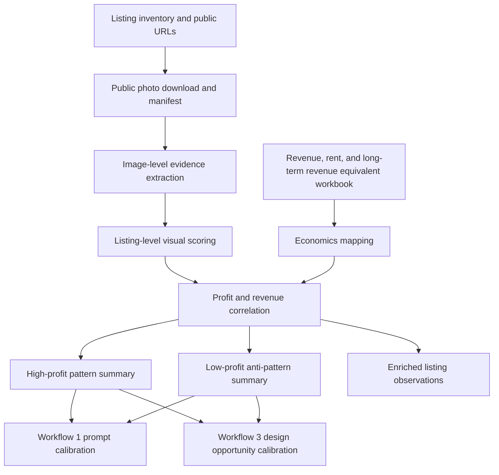

# Airbnb.com.au - Visual Revenue Workflows

Use this file when the host wants to connect listing photos, visible features,
copywriting, interior presentation, and portfolio economics. These workflows
turn visual observations into auditable prompts, profit correlations, and
low-cost design actions.

These workflows are evidence and recommendation workflows. They do not change
Airbnb listings, upload images, edit photos, or buy items. If an accepted action
will be published, log it through `decisioning.md` with rollback, review window,
and outcome metrics.

Authoritative row contracts live in `schema-visual-revenue.md`. This file owns
the workflow control path, judgement rules, scoring logic, and acceptance
criteria; the schema file owns the persistent field lists.

## Ownership

- Use this when: the user wants image-improvement prompts, photo/profit
  correlation, visual listing observations, or low-cost design/staging
  opportunities.
- Owns: visual workflow control paths, scoring logic, accuracy gates, storage
  layout, prompt/design opportunity rules, and calibration handoffs.
- Does not own: raw Airbnb public/host collection, publishable listing copy,
  durable row field lists, or implemented action tracking.
- Next hop: `schema-visual-revenue.md` for row contracts,
  `content-optimization-playbook.md` when action copy/gallery craft is needed,
  and `decisioning.md` when an accepted visual recommendation becomes an action.

## Contents

| Workflow | Goal | Primary inputs | Outputs |
|---|---|---|---|
| [Workflow 1](#workflow-1---inferior-image-improvement-prompts) | Generate one image-improvement prompt per inferior photo while preserving factual accuracy | Existing image files, listing facts, room/amenity constraints | `airbnb_image_improvement_prompt` rows |
| [Workflow 2](#workflow-2---portfolio-visual-profit-correlation) | Examine all listings, photos, features, and copy, then correlate observations with revenue/profit spreadsheet data | Airbnb listing inventory, public listing scrape, photo observations, Excel/CSV economics | `airbnb_visual_listing_observation`, `airbnb_visual_image_observation`, high/low pattern summaries, correlation workbook/report |
| [Workflow 3](#workflow-3---lowest-cost-highest-leverage-design-improvements) | Rank practical interior-design changes by expected conversion leverage and cost | Listing photos, listing facts, visual gaps, Workflow 2 high/low patterns, optional profit data | `airbnb_interior_design_opportunity`, `airbnb_portfolio_design_action` rows |

## Shared Principles

- Preserve source truth. Do not overwrite the original listing inventory or
  scraped source records. Save workflow outputs as timestamped sidecars keyed by
  `listing_id`.
- Prefer actual image evidence over copy-derived proxies. `photo_count` is not a
  substitute for reviewing the images.
- Separate guest-demand value from accounting effects. Profit can be driven by
  rent, owner arrangement, seasonality, or unit size; visual correlations are
  directional unless controlled for those confounders.
- Do not fabricate property features, views, room size, amenities, fixtures,
  furniture, whitegoods, parking, or neighbourhood facts.
- Keep prompt and recommendation outputs auditable: every prompt or design
  suggestion needs evidence references, source image IDs or contact-sheet
  ordinals, and an accuracy or confidence score.

## Storage Layout

Use timestamped run directories under ignored private data:

```text
domain-skills/airbnb/.private-data/photo-observations/{run_id}/
  photo_manifest.json
  visual_observations.json
  contact-sheets/{listing_id}.jpg
  images/{listing_id}/{ordinal}_{photo_key}.jpg

domain-skills/airbnb/.private-data/image-improvement-prompts/{run_id}.json
domain-skills/airbnb/.private-data/interior-design-opportunities/{run_id}.json
outputs/{run_id}/visual_profit_correlation.xlsx
```

When enriching listing data, write an additive copy such as
`airbnb-live-listings-...-with-photo-observations.json`. Do not mutate the
canonical scraped listing file in place.

## Workflow 1 - Inferior Image Improvement Prompts

Goal: take existing inferior listing images, such as iPhone photos, and produce
one image-model prompt per image that improves commercial quality while keeping
the image at least 70% factually accurate to the source.

The host's "do not reduce accuracy by more than 30%" requirement maps to:

```text
accuracy_retention_score >= 70/100
```

If an improvement requires changing material property facts, create a reshoot or
staging recommendation instead of a generative edit prompt.

### Portfolio-Calibrated Priorities

Use the latest portfolio correlation workbook, when available, to choose what
the prompt tries to improve. In the MSA real-photo calibration run, the strongest
positive directional signals were:

| Signal | Directional correlation to profit | Prompt implication |
|---|---:|---|
| Computed sharpness proxy | `0.6890` | prioritize clarity, denoise, sharpening, lens correction, and crisp subject edges |
| Interior design score | `0.4722` | make the existing room read more polished, styled, and intentional without inventing furnishings |
| Composition score | `0.3784` | straighten verticals, crop to the room's strongest line, reduce dead space, and make the subject instantly legible |
| Visual brightness score | `0.3427` | brighten plausibly, correct white balance, and recover shadows without changing aspect or real light source |
| Hero strength | `0.2205` | make the image work as a thumbnail by emphasizing the actual booking hook |

Low-profit anti-patterns seen in the same run:

- hero image is a TV/detail shot rather than a property hook
- gallery feels functional rather than aspirational
- interiors look basic, dated, dim, or carpet-heavy
- first-five sequence includes exterior/local/common-area filler before the
  property is proven
- amenity proof is weak or absent where amenities are claimed
- compact bedrooms or narrow rooms are shown without a clear layout/readability
  strategy

These are prompt priorities, not permission to fabricate. If an image cannot
honestly show the missing value, emit a `reshoot_or_resequence_needed` action
instead of a heavy edit prompt.

Interpret the calibration this way when writing the actual image prompt:

- `avg_image_sharpness_proxy` was the strongest positive signal, so the prompt
  should almost always improve clarity before trying more subjective styling.
- `interior_design`, `composition`, and human-scored `brightness_visual` moved
  with high profit, so the prompt should make the existing room feel intentional,
  straight, clean, and legible.
- computed raw brightness was slightly negative while human-scored brightness was
  positive, so do not simply make images brighter. Prefer balanced exposure,
  accurate colour, recovered shadows, and preserved window/view detail.
- view and amenity proof were valuable in individual high-profit listings, but
  their simple correlations were negative in this small workbook. Treat them as
  source-visible hooks to preserve or clarify, not generic things to add or
  overemphasize.
- high-profit galleries usually had a clear first-five story: strong hero,
  real view/balcony or amenity proof when present, crisp bedrooms/living spaces,
  and little filler before the property value was proven.

Use this default prompt weighting unless a newer workbook overrides it:

| Prompt priority | Weight | What the prompt should do |
|---|---:|---|
| Clarity, sharpness, denoise, lens correction | 30 | make the image crisp and professional without artificial edge halos |
| Composition and subject hierarchy | 20 | straighten, crop, reduce dead space, and make the booking hook obvious |
| Interior polish from existing facts | 20 | make real finishes, styling, surfaces, and room presentation read cleaner and more intentional |
| Plausible light and colour | 15 | improve white balance, shadows, and contrast without overexposure or fake sunlight |
| Source-visible revenue hook | 10 | preserve or clarify real balcony, view, courtyard, pool, gym, parking, capacity, or architectural charm |
| Resequence/reshoot recommendation | 5 | flag images that are structurally bad hero candidates instead of over-editing them |

Use the workbook examples to select the prompt intent before writing the prompt:

| Pattern seen in source image or current gallery | Profit lesson | Prompt intent |
|---|---|---|
| crisp room photo with clear bed/living/kitchen/bathroom proof | high-profit listings had stronger sharpness, composition, and room proof | `crisp_core_room_upgrade` |
| real skyline, terrace, balcony, courtyard, garden, or architectural charm | strong when it is real and appears early enough in the gallery | `real_hook_clarification` |
| pool, gym, sauna, tennis, or parking is genuinely visible | useful as proof, but not a substitute for strong interiors | `amenity_proof_clarification` |
| image could be hero or first-five but the subject is unclear | hero strength and first-five strength were higher in the top quartile | `hero_hook_upgrade` |
| room is compact, narrow, or plain | low performers often made small rooms feel worse through weak angle/crop | `compact_room_readability` |
| interior feels dim, dated, basic, carpet-heavy, or flat | this was the clearest recurring low-profit interior anti-pattern | `dated_basic_interior_cleanup` |
| TV, detail, screenshot, duplicated view, local/lifestyle, exterior, or common-area filler | low-profit pattern unless it proves a specific useful fact | `support_image_or_resequence` |
| missing hook would require adding a view, balcony, amenity, furniture, or renovation | fabrication risk is higher than conversion upside | `reshoot_or_no_safe_prompt` |

The prompt must improve the selected intent, not every possible attribute.
Example: a dim bedroom should not receive a balcony/view prompt; a balcony shot
should not receive fake interior styling; a TV/detail hero should usually receive
a demotion/resequence recommendation rather than a hero edit.

### Inputs

Required:

- `listing_id`
- source image path or URL
- source image hash
- source image ordinal or filename
- room/area label when known
- known listing facts: bedrooms, bathrooms, guest cap, parking, balcony/view,
  pool/gym/sauna, workspace, laundry, pet-friendly status
- host constraints: what must not be shown, privacy constraints, brand style

Optional but useful:

- target guest segment
- current hero/first-five order
- comp-set visual patterns
- latest high-profit and low-profit pattern summary
- correlation workbook path and run ID when the prompt is calibrated from a
  portfolio analysis
- accepted colour palette or styling references
- known defects from visual review

### Material Accuracy Rules

Allowed edits usually include:

- exposure, white balance, contrast, dehaze, denoise, sharpening, lens
  correction, vertical straightening, crop, glare reduction, and mild shadow
  recovery
- removing temporary clutter that is not a material amenity or fixture
- making linen, towels, cushions, or removable styling look neater when those
  items are already present
- replacing a black TV reflection with a neutral dark screen
- improving sky/window exposure only when the real view remains the same
- adding no more than light editorial polish to surfaces, walls, and floors

Forbidden edits include:

- adding or removing windows, doors, walls, balconies, courtyards, pools, gyms,
  parking spaces, city/water views, landmarks, appliances, beds, desks, or rooms
- making a room materially larger, brighter than plausible, more open-plan, or
  higher-floor than it is
- changing permanent finishes such as flooring, benchtops, cabinetry, tiles,
  bathroom fixtures, built-ins, or view direction
- adding luxury furniture, artwork, plants, appliances, or decor that will not
  actually be present for guests
- hiding safety/access constraints, stairs, tight layouts, worn finishes, or
  neighbouring-building view obstructions
- inventing labels, logos, signs, parking bay numbers, Wi-Fi speed tests, or
  floor-plan facts

### Prompt Generation Steps

1. Create an image observation record.

```text
image_id
listing_id
source_path
source_hash
photo_ordinal
room_or_area
calibration_run_id
current_quality_issues
commercial_goal
profit_pattern_basis
source_image_evidence_summary
image_profit_pattern_class
primary_prompt_intent
high_profit_pattern_to_strengthen
low_profit_antipattern_to_reduce
source_visible_revenue_hooks
missing_or_unprovable_hooks
factual_anchors
forbidden_changes
candidate_prompt_score_0_100
recommended_gallery_action
accuracy_retention_floor = 70
```

2. Classify the image problem.

Use these classes:

```text
dark_or_flat
wrong_white_balance
crooked_verticals
wide_angle_distortion
glare_or_reflection
clutter_or_mess
poor_crop
weak_hero_readability
tv_or_detail_as_hero
generic_common_area_or_local_filler
unclear_layout
compact_room_needs_layout_clarity
understyled_but_accurate
functional_not_aspirational
dated_or_basic_finish
weak_amenity_proof
weak_view_or_balcony_proof
overbright_or_hdr_fake
plain_bedroom_or_basic_interior
repetitive_or_low_value_detail
diluted_by_location_lifestyle
weak_capacity_proof
low_resolution_or_noise
```

3. Extract source evidence and choose one primary prompt intent.

Do not write the image prompt until these fields are explicit:

```text
source_image_evidence_summary:
- room_or_area visible
- visible fixed features
- visible removable contents
- visible view/outdoor/amenity proof
- visible constraints or defects
- current gallery position risk

image_profit_pattern_class:
- high_profit_signal_present
- low_profit_antipattern_present
- mixed_signal
- no_safe_revenue_signal

primary_prompt_intent:
- crisp_core_room_upgrade
- real_hook_clarification
- amenity_proof_clarification
- hero_hook_upgrade
- compact_room_readability
- dated_basic_interior_cleanup
- support_image_or_resequence
- reshoot_or_no_safe_prompt
```

Choose only one primary intent. Secondary edits are allowed only when they do not
dilute the primary intent or increase factual risk.

4. Assign the image improvement strategy.

Use the highest applicable strategy:

| Image role | Best strategy |
|---|---|
| Candidate hero or first-five image | optimize thumbnail readability, booking hook, composition, straightness, plausible brightness, and crispness |
| Bedroom/living/kitchen/bathroom proof | improve crispness, interior polish, layout readability, colour fidelity, and clean presentation |
| View/balcony/amenity proof | clarify the real view or amenity only if it is actually present; preserve obstructions and do not invent skyline, pool, gym, parking, or outdoor area |
| Exterior/local/common-area filler | usually recommend resequencing or replacement, not heavy enhancement; use only after core property value is proven |
| TV/detail/clutter image | demote from hero/first-five and generate a prompt only if it still proves a useful property fact |

5. Score whether a prompt is actually worth generating.

Use the score to decide whether the row gets an image edit prompt,
`resequence_needed`, `reshoot_needed`, or `no_safe_prompt`.

```text
candidate_prompt_score_0_100 =
  30 * clarity_fixable
+ 20 * composition_fixable
+ 20 * interior_polish_fixable
+ 15 * light_colour_fixable
+ 10 * source_visible_revenue_hook_clarifiable
+  5 * supports_first_five_story
- 30 * requires_fabricating_missing_hook
- 20 * structurally_bad_hero_candidate
- 15 * accuracy_risk_high
```

Generate a prompt when `candidate_prompt_score_0_100 >= 45`. Below that, prefer
`reshoot_needed`, `resequence_needed`, or `no_safe_prompt` with the reason.

Use these gallery actions:

```text
edit_and_keep_position
edit_but_demote_from_first_five
edit_as_supporting_proof
resequence_needed
reshoot_needed
no_safe_prompt
```

6. Generate one prompt per image.

Prompt template:

```text
Improve this real Airbnb listing photo for commercial presentation while
preserving factual accuracy. Keep the same room, layout, window positions,
view, fixtures, finishes, furniture, appliances, amenities, and spatial scale.

Portfolio-calibrated objective from {calibration_run_id}:
- source evidence summary: {source_image_evidence_summary}
- image profit pattern class: {image_profit_pattern_class}
- primary prompt intent: {primary_prompt_intent}
- strengthen this high-profit pattern: {high_profit_pattern_to_strengthen}
- reduce this low-profit anti-pattern: {low_profit_antipattern_to_reduce}
- follow this priority order: crisp clarity first, then composition and subject
  hierarchy, then existing-room polish, then plausible light and colour, then
  source-visible revenue hooks
- do not force view, balcony, pool, gym, parking, workspace, architectural charm,
  or luxury cues into the image unless the source image already proves them
- if this image is a weak hero because it is a TV/detail/common-area/location
  filler shot, improve only as a support image and recommend resequencing rather
  than trying to make it the main hook

Intent-specific instructions:
- if `crisp_core_room_upgrade`: prioritize denoise, deblur, straight verticals,
  clean crop, accurate colour, and clear room function
- if `hero_hook_upgrade`: make the actual source-visible booking hook legible in
  thumbnail form without changing room scale, view, or amenities
- if `real_hook_clarification`: preserve the exact real view/outdoor/architectural
  hook and improve exposure/contrast only enough to make it readable
- if `amenity_proof_clarification`: make the real amenity proof clearer, but keep
  signage, equipment, pool/gym layout, access limits, and surrounding context true
- if `compact_room_readability`: use straight lines and a truthful crop to make
  layout understandable; do not widen, stretch, remove constraints, or imply more
  usable space
- if `dated_basic_interior_cleanup`: improve cleanliness, colour balance, glare,
  wrinkles, shadows, and presentation of existing finishes; do not renovate,
  replace carpet, hide dated fixtures, or add styling
- if `support_image_or_resequence`: improve only basic clarity and recommend a
  lower gallery position unless it proves a specific source-visible fact

Image role:
- {image_role}

Recommended gallery action:
- {recommended_gallery_action}

Primary improvements:
- {issue_specific_edits}

Keep these source-visible revenue hooks prominent:
- {source_visible_revenue_hooks}

Do not chase these missing or unprovable hooks:
- {missing_or_unprovable_hooks}

Factual anchors that must remain unchanged:
- {factual_anchors}

Do not:
- add, remove, replace, or materially alter any permanent property feature
- make the room look materially larger or more luxurious than the source
- invent views, amenities, furniture, appliances, decor, signage, or lighting
- replace carpet, flooring, cabinetry, benchtops, tiles, bathroom fixtures,
  windows, doors, balcony rails, or building surroundings
- hide constraints that a guest would notice on arrival
- hide real neighbouring-building obstructions, compact room scale, dated
  finishes, or access constraints

Accuracy requirement:
- retain at least 70/100 factual accuracy to the source image
- if an edit would reduce accuracy below that, leave the source detail unchanged

Output style:
- natural real-estate photography
- balanced, plausible exposure with preserved highlights and window detail
- straight verticals
- accurate colours
- crisp but not artificial sharpness
- warmer and more inviting only within the real lighting and finishes
- professional but not HDR, CGI, showroom, luxury-renovated, or over-staged
```

7. Generate a negative prompt.

```text
No new furniture, no new decor, no changed layout, no enlarged windows, no
changed view, no changed flooring, no changed cabinetry, no changed bathroom
fixtures, no fake balcony, no fake pool, no fake gym, no luxury renovation,
no fake parking, no fake workspace, no artificial sunlight that changes the real
aspect, no text overlays, no removing permanent obstructions, no making a
compact room look materially larger, no fake high floor, no changed carpet,
no hidden neighbouring buildings, no over-bright HDR look, no plastic CGI
surfaces, no fake linen or styling that will not be present for guests.
```

8. Add an accuracy check prompt for the edited result.

```text
Compare the edited image against the source. Return JSON with:
accuracy_retention_score_0_100
material_changes_detected
allowed_improvements_detected
high_profit_signal_improvements_detected
low_profit_antipatterns_reduced
prompt_priority_followed
primary_prompt_intent_preserved
unproven_hooks_introduced
commercial_quality_delta_0_100
recommended_gallery_action_still_valid
guest_misrepresentation_risk
pass_fail

Fail if accuracy_retention_score_0_100 < 70 or if any material property fact
was added, removed, or changed.

Also fail if the edit creates a false high-profit cue, including fake view,
fake balcony/outdoor space, fake pool/gym/parking, fake workspace, materially
larger room scale, luxury finishes not present, or furniture/decor that will not
be present for guests.

Also fail if the image is merely brighter but less accurate, over-HDR, less
sharp, less natural, or more misleading about room size, finish quality, view,
amenity access, or first-five suitability.
```

### Output Row

Persist one `airbnb_image_improvement_prompt` row per source image prompt
candidate. The authoritative field list is in `schema-visual-revenue.md`.

### Acceptance Criteria

- Every inferior image receives one prompt or an explicit `no_safe_prompt`
  reason.
- Every prompt includes factual anchors and forbidden changes.
- Prompts do not authorize material changes to property facts.
- Every prompt states which high-profit visual signal it is trying to improve
  and which low-profit anti-pattern it is trying to reduce.
- Images that cannot safely improve a high-value signal are marked
  `reshoot_or_resequence_needed` instead of receiving an overreaching prompt.
- Prompts prioritize sharpness, composition, interior polish, and plausible
  light before view/amenity amplification unless the source visibly proves the
  view or amenity.
- Every generated prompt has exactly one primary prompt intent, grounded in
  source-visible evidence and the high/low profit pattern analysis.
- Weak hero candidates such as TV/detail/common-area/location filler shots get a
  gallery-action recommendation, not a fake hero prompt.
- Compact, dated, basic, or dim rooms are improved through truthful readability
  and presentation, not virtual renovation.
- The generated check prompt can fail an over-edited image.
- Outputs are saved to `.private-data/image-improvement-prompts/{run_id}.json`.

## Workflow 2 - Portfolio Visual Profit Correlation

Goal: take all current Airbnb listings plus an Excel or CSV file containing
revenue, rent, profit, or long-term equivalent revenue, examine listings,
features, copy, and real photos, save observations to listing files, and
determine directional correlations.

This is the repeatable version of the real-photo profit workflow.

The output should not be only a correlation workbook. It must also create a
reusable calibration layer that feeds:

- Workflow 1 image-improvement prompts
- Workflow 3 interior-design opportunity scoring
- listing-level visual observation files
- high-profit and low-profit pattern summaries for future candidate scoring

The thread's current MSA calibration showed the practical lesson: high profit
was more consistently associated with crispness, composition, interior polish,
first-five strength, and believable presentation than with blindly emphasizing
views or amenities. Views, balconies, pool, gym, parking, courtyard, and
architectural charm remain important, but only when they are source-visible,
accurately photographed, and sequenced before weaker filler.

### Inputs

Required:

- latest complete `airbnb-live-listings-*.json`
- public listing URLs for each active listing
- economics workbook or CSV with a stable join key such as unit code, listing
  nickname, address unit prefix, listing ID, or host nickname

Optional:

- latest own-public listing scrape with title, raw copy, amenities, reviews,
  and search appearance
- reservation, revenue, owner statement, rent, and cost exports
- manual mapping overrides when spreadsheet unit codes do not match listing
  nicknames
- existing Workflow 1 image prompt rows for inferior images
- existing Workflow 3 design recommendations and completed action outcomes
- previous calibration workbook and pattern summaries, to compare whether
  signals persisted or changed

### Control Path



Do not skip pages or photos that are available in the public gallery. If a photo
cannot be downloaded or reviewed, record the blocker at image level and keep the
listing in the cohort with coverage flags.

### Collection Steps

1. Validate source completeness.

Required gates:

- listing inventory is not marked `partial_run`
- active listing count is known
- public listing URLs are present
- economics file has at least one join key and one target metric

2. Download public listing photos.

For each listing:

- fetch the public listing page
- extract real `a0.muscache.com` listing image URLs
- include normal, `prohost-api`, numeric `Hosting-*`, and encoded `Hosting-*`
  gallery path variants
- deduplicate by original image path
- download bounded-size copies for local review
- compute deterministic image metrics: brightness, aspect ratio, sharpness
  proxy, dimensions
- create a contact sheet containing all downloaded images in gallery order

Persist:

```text
photo_manifest.json
images/{listing_id}/{ordinal}_{photo_key}.jpg
contact-sheets/{listing_id}.jpg
```

3. Visually score each listing.

Score each listing from the contact sheet:

```text
overall_photo_score_0_100
hero_strength_0_100
first_five_strength_0_100
view_quality_0_100
amenity_visual_proof_0_100
interior_design_0_100
brightness_visual_0_100
composition_0_100
room_coverage_0_100
visual_strengths
visual_issues
```

Also score and tag the individual photos that explain the listing score:

```text
image_id
photo_ordinal
room_or_area
source_image_evidence_summary
image_profit_pattern_class
primary_prompt_intent_candidate
source_visible_revenue_hooks
missing_or_unprovable_hooks
high_profit_pattern_to_strengthen
low_profit_antipattern_to_reduce
accuracy_risk_notes
recommended_gallery_action
```

Use the same pattern taxonomy as Workflow 1:

```text
crisp_core_room_upgrade
real_hook_clarification
amenity_proof_clarification
hero_hook_upgrade
compact_room_readability
dated_basic_interior_cleanup
support_image_or_resequence
reshoot_or_no_safe_prompt
```

Also store the coverage, image-stat, and contact-sheet fields defined on
`airbnb_visual_listing_observation` in `schema-visual-revenue.md`.

4. Extract listing feature and copy signals.

Use public listing text and amenities for:

```text
parking_flag
pool_flag
gym_flag
view_flag
balcony_flag
sauna_flag
aircon_flag
lift_flag
copy_word_count
title_length
title_feature_count
review_count
overall_rating
```

Do not infer visual proof from copy alone. Copy can establish a claim; photos
must prove it visually.

Classify each claim as:

```text
claimed_and_visually_proven
claimed_not_visually_proven
visually_proven_not_claimed
not_claimed_not_proven
```

This matters because the MSA run found examples where valuable amenities were
claimed but not visually proven in the extracted gallery, and examples where
views or amenities existed but did not overcome weak interiors or weak hero
sequencing.

5. Map economics to listings.

Preferred join order:

1. explicit listing ID
2. unit code in listing nickname
3. address unit prefix
4. manual mapping table
5. fuzzy title/address match, only with human review

Record:

```text
match_status
match_confidence
match_basis
unmapped_economics_rows
unmatched_active_airbnb_rows
```

6. Compute target metrics.

Use the strongest available economics source:

```text
revenue
rent
profit_revenue_minus_rent
long_term_revenue_equiv_weekly
avg_monthly_revenue
avg_monthly_rent
avg_monthly_profit
profit_margin_on_revenue
```

7. Compute correlations and cohort differences.

For each numeric or binary feature:

- Pearson correlation to profit
- Pearson correlation to revenue
- average feature value for top quartile profit
- average feature value for bottom quartile profit
- high-minus-low cohort delta
- sample size and missing count

For binary features, also compute:

```text
n_true
n_false
avg_profit_true
avg_profit_false
profit_delta_true_minus_false
```

For photo and copy features, compute at least these target relationships:

```text
correlation_to_revenue
correlation_to_rent
correlation_to_profit_revenue_minus_rent
correlation_to_long_term_revenue_equiv_weekly
top_quartile_avg
bottom_quartile_avg
top_minus_bottom_delta
ranked_high_profit_pattern_frequency
ranked_low_profit_antipattern_frequency
```

Use both listing-level scores and image-level pattern counts. A listing can have
strong amenities and still be low-profit if the interior signal, first-five
sequence, or hero image is weak. Do not collapse those cases into a single
`has_view` or `has_pool` field.

8. Interpret confounders.

Always report:

- rent effect
- revenue effect
- outliers
- low-variation features
- properties whose profit is driven by unusual rent/owner economics rather than
  Airbnb demand
- whether visual correlations conflict with strategic prior

9. Produce high-profit and low-profit pattern summaries.

Create a written pattern summary that is specific enough to change future
prompts and design decisions.

High-profit pattern summary should include:

```text
pattern_id
pattern_label
supporting_listings
supporting_photo_ordinals
metric_basis
example_visual_strengths
where_to_apply
where_not_to_apply
confidence
```

Low-profit anti-pattern summary should include:

```text
antipattern_id
antipattern_label
affected_listings
affected_photo_ordinals
metric_basis
example_visual_issues
recommended_fix_type
do_not_fix_by
confidence
```

Use the MSA pattern classes unless a newer run disproves them:

```text
high_profit_patterns:
- crisp, sharp, professional core-room proof
- strong first-five story before filler
- real skyline, terrace, balcony, courtyard, garden, or architectural charm
- pool/gym/sauna/parking proof when it is real and visually clear
- warm but accurate interiors
- clean bedroom/living/kitchen/bathroom coverage

low_profit_antipatterns:
- TV/detail shot used as hero
- local, exterior, common-area, screenshot, or duplicated view filler before
  core property proof
- interiors that read basic, dated, dim, flat, carpet-heavy, or under-styled
- compact rooms photographed without truthful layout readability
- amenity claims without visual proof
- view/amenity proof that cannot overcome weak interior or sequencing
```

10. Write observations back to listing data.

Write only additive fields. Do not overwrite the original listing export.

At listing level, add:

```text
visual_profit_calibration_run_id
visual_profit_score_inputs
high_profit_patterns_present
low_profit_antipatterns_present
visual_revenue_hypotheses
workflow_1_prompt_calibration_notes
workflow_3_design_calibration_notes
correlation_confidence
residual_confounders
```

At image level, add:

```text
photo_observations
photo_ordinal
source_url
local_path
source_hash
room_or_area
source_image_evidence_summary
image_profit_pattern_class
primary_prompt_intent_candidate
source_visible_revenue_hooks
missing_or_unprovable_hooks
recommended_gallery_action
accuracy_risk_notes
```

### Output Artifacts

Persist the visual observations as an additive sidecar:

```text
domain-skills/airbnb/.private-data/photo-observations/{run_id}/visual_observations.json
```

Write an enriched listing copy:

```text
airbnb-live-listings-{timestamp}-with-photo-observations.json
```

Produce a workbook/report with tabs:

```text
Dashboard
Unit Photo Mapping
Photo Profit Calibration
Feature/Copy Calibration
Visual Observations
Image-Level Observations
High-Profit Patterns
Low-Profit Anti-Patterns
Workflow 1 Prompt Inputs
Workflow 3 Design Inputs
Sources Notes
```

### Output Row

Persist one `airbnb_visual_listing_observation` row per listing per run. The
authoritative field list is in `schema-visual-revenue.md`.

Image-level output row:

Persist one `airbnb_visual_image_observation` row per reviewed image. The
authoritative field list is in `schema-visual-revenue.md`.

### Interpretation Rules

- `photo_count` is only a coverage signal, not a quality signal.
- Strong positive correlation from a small sample is a hypothesis, not a rule.
- Strong negative correlation on strategic amenities can be a rent or outlier
  artifact.
- If nearly every listing has a feature, the feature cannot be estimated from
  this portfolio even if it is strategically important.
- Report `directional_only_small_sample` when matched `n < 30`.
- Do not recommend removing an amenity or ignoring a view because one portfolio
  sample shows a negative correlation.
- Treat a negative correlation on views or amenities as a prompt to inspect
  sequencing, rent, cohort mix, and interior weakness before changing strategy.
- Prefer cohort deltas and concrete high/low examples over a single coefficient
  when the sample is small.
- Calibration should decide what to emphasize and how to sequence, not authorize
  fabricated photo edits or virtual renovations.
- When a pattern is useful for Workflow 1, phrase it as a source-visible prompt
  instruction. When it is useful for Workflow 3, phrase it as a real-world
  staging, reshoot, or low-cost design intervention.

### Acceptance Criteria

- Every active listing has either a visual observation or a recorded blocker.
- Every downloaded image is traceable to source URL and local path.
- Every reviewed image has an image-level evidence summary and pattern class.
- Visual observations are saved under `.private-data/photo-observations/`.
- Original listing files are not overwritten.
- Correlation outputs include sample size and confidence.
- The workbook/report states confounders and low-variation limitations.
- The run outputs high-profit and low-profit pattern summaries.
- The run produces Workflow 1 prompt calibration inputs and Workflow 3 design
  calibration inputs.
- Additive enriched listing data records which patterns are present, which
  anti-patterns are present, and what remains confounded or unproven.

## Workflow 3 - Lowest-Cost Highest-Leverage Design Improvements

Goal: examine listing photos, features, and visual issues, then recommend the
lowest-cost interior-design changes most likely to improve conversion and
revenue.

This workflow prioritizes reversible styling and presentation changes before
renovations. It is suitable for existing furnished Airbnb listings. For rental
arbitrage candidates that are still unfurnished, treat outputs as a staging
budget and exclude any landlord fixture changes unless explicitly allowed.

The workflow must optimize for "highest leverage per dollar", not nicest
interior in the abstract. The current calibration from this thread weights
crispness, composition, interior polish, first-five strength, and truthful
source-visible hooks ahead of expensive redesign. Views, balcony/courtyard,
parking, pool, and gym remain high-value hooks, but this workflow should improve
how those hooks are proven and sequenced before recommending spend.

### Operating Modes

Choose one mode at the start of each run:

| Mode | Use when | Recommendation scope |
|---|---|---|
| `active_furnished_listing` | the Airbnb is already live and furnished | reorder, reshoot, styling refresh, reversible decor, targeted replacements |
| `unfurnished_arbitrage_candidate` | applying as tenant and photos show an empty rental | staging package, photography plan, layout thesis, removable items only |
| `portfolio_bulk_upgrade` | the same issue appears across several listings | standardized purchase kits, shot lists, sequencing rules, reusable supplier brief |

For `unfurnished_arbitrage_candidate`, do not score existing furniture,
whitegoods, or removable decor as a property advantage. Score only the apartment,
building, layout, natural light, view/outdoor area, parking, pool/gym/amenities,
finish quality, constraints, and the cost to create the required Airbnb-ready
presentation after lease approval.

### Hard Exclusions

Reject or mark `owner_approval_required` before scoring when a recommendation
requires:

```text
flooring_replacement
kitchen_or_bathroom_fixture_change
cabinetry_or_benchtop_change
window_or_door_change
structural_layout_change
permanent_electrical_or_plumbing_work
whitegoods_or_appliance_replacement_for_unfurnished_candidate
painting_without_owner_approval
concealing_material_defects_or_access_constraints
photo_or_copy_claim_that_guests_will_not_receive
```

### Inputs

Required:

- listing inventory
- contact sheets or listing photos
- visual observations from Workflow 2, or a fresh visual scoring pass
- listing facts and claims: bedrooms, beds, guest cap, parking, balcony,
  workspace, pool/gym/sauna, laundry, pet-friendly status
- Workflow 2 high-profit pattern summary
- Workflow 2 low-profit anti-pattern summary

Optional:

- profit/revenue workbook
- comp-set photo patterns
- guest segment thesis
- known supply constraints and owner approvals
- budget cap
- current first-five gallery order
- Workflow 1 prompt rows and accuracy-check outcomes
- previous design actions and post-change performance outcomes
- supplier catalogue or actual purchase cost table

### Improvement Classes

Always evaluate no-cost and photo-only improvements before purchase
recommendations.

Prefer low-cost reversible changes:

```text
first_five_resequence
hero_angle_reshoot
daylight_reshoot
amenity_proof_reshoot
view_balcony_pair_reshoot
photo_edit_prompt_from_workflow_1
declutter_and_surface_reset
linen_refresh
bed_layering
cushions_and_throw
accent_colour
lamp_or_warm_lighting
artwork_or_wall_scale
plant_or_greenery
rug_or_zone_definition
coffee_table_styling
dining_table_styling
balcony_outdoor_setting
workspace_upgrade
cable_management
towel_and_bathroom_styling
kitchen_counter_styling
mirror_or_light_reflection
curtain_blind_presentation
```

Escalate only when the photo evidence shows a real conversion blocker:

```text
replace_sofa_or_armchair
replace_bedhead_or_base
replace_bedside_tables
paint_touch_up
replace_rug
replace_dated_art
replace_balcony_furniture
improve_task_lighting
replace_low_quality_linen_set
replace_broken_or_visibly_worn_item
```

For unfurnished arbitrage candidates, express the recommendation as a staging
package rather than an edit to current furniture:

```text
minimum_airbnb_bedroom_kit
living_room_anchor_kit
compact_dining_or_workstation_kit
balcony_courtyard_kit
lighting_and_softness_kit
art_and_wall_scale_kit
photography_day_prep_kit
building_amenity_proof_shot_list
```

### Scoring

Score only opportunities that pass the evidence and exclusion gates.

Required gates:

```text
photo_evidence_present = true
property_fact_preserved = true
guest_receives_claimed_improvement = true
owner_approval_status in [not_required, approved, required_and_marked]
```

Score each component from 0-100:

```text
RevenueHook:
  How strongly this improvement exposes a revenue-relevant hook.
  Highest hooks: view, balcony/courtyard, parking, pool, gym, strong bedroom
  proof, guest capacity proof, work-from-home proof, architectural charm.

FirstFiveImpact:
  How much the change improves hero or first-five conversion.

GapSeverity:
  How visibly the current photo/listing underperforms: TV/detail hero, dim room,
  dated/basic interior, compact room confusion, missing amenity proof, filler
  before property proof.

CostEfficiency:
  Expected uplift per dollar. No-cost resequencing and reshoot fixes should
  score very high when the gap is real.

SpeedToImplement:
  Can the operator do this before the next shoot or listing refresh?

ReusabilityAcrossListings:
  Can this become a repeatable portfolio kit or rule?

AccuracySafety:
  Does it reduce conversion risk without making the listing misleading?
```

Rank each opportunity with:

```text
leverage_score = 0.25 x RevenueHook
               + 0.20 x FirstFiveImpact
               + 0.15 x GapSeverity
               + 0.15 x CostEfficiency
               + 0.10 x SpeedToImplement
               + 0.10 x ReusabilityAcrossListings
               + 0.05 x AccuracySafety

cost_penalty = cost_band_index * 4
risk_penalty = owner_approval_penalty
             + misrepresentation_penalty
             + operational_complexity_penalty

priority_score = leverage_score - cost_penalty - risk_penalty
```

Cost bands:

| Cost band | Index | Guide | Use for |
|---|---:|---:|---|
| `no_cost` | 0 | `$0` | reorder, declutter, clean, open blinds, use existing items |
| `shoot_only` | 1 | `$0-$250` | reshoot, photographer direction, Workflow 1 edit prompt |
| `very_low` | 2 | `$1-$150` | linens, towels, bulbs, small styling objects |
| `low` | 3 | `$150-$500` | cushions, lamps, art, plant, small balcony setting |
| `medium` | 4 | `$500-$1,500` | rug, bedhead, small furniture, workspace kit |
| `high` | 5 | `$1,500+` | large furniture, multi-room package, owner approval likely |

For `unfurnished_arbitrage_candidate`, classify a whole-room staging kit by the
incremental cost above the minimum required furnishing package. Do not let a
basic required bed/sofa purchase appear as a high-leverage "improvement" unless
the recommendation is about the incremental choice that raises revenue.

Priority tiers:

| Tier | Score | Use when |
|---|---:|---|
| `do_now` | `>= 75` | high leverage, cheap, accurate, fast |
| `batch_next_shoot` | `65-74` | strong but needs shoot/staging day |
| `buy_once_apply_many` | `60-74` | moderate single-listing impact but strong portfolio reuse |
| `test_if_budget` | `50-64` | plausible but evidence is weaker or cost is medium |
| `defer` | `35-49` | not urgent, too costly, or not tied to first-five/revenue hook |
| `reject` | `< 35` or failed gate | misleading, landlord-controlled, too costly, or unsupported |

### Pareto Selection

After scoring, choose the lowest-cost highest-leverage frontier rather than a
long undifferentiated list.

An opportunity is dominated when another opportunity:

```text
fixes_the_same_bottleneck = true
priority_score >= current.priority_score
estimated_cost_aud <= current.estimated_cost_aud
accuracy_or_operational_risk <= current.risk
implementation_time <= current.implementation_time
```

Default selection rules:

- pick no-cost, `shoot_only`, or `very_low` fixes first when they address the
  same bottleneck
- do not recommend buying items until resequencing, cleaning, daylight reshoot,
  and Workflow 1 edit prompts have been considered
- keep only the best action per bottleneck unless the second action is a clear
  follow-on dependency
- reserve `high` cost actions for portfolio-wide reuse, severe first-five gaps,
  or major source-visible hooks
- when a budget cap exists, select the highest total `priority_score` set that
  stays under the cap and covers the most distinct bottlenecks

Estimate simple payback when revenue data exists:

```text
expected_monthly_revenue_uplift_band_aud
expected_monthly_profit_uplift_band_aud
payback_weeks_low
payback_weeks_high
```

Use ranges, not false precision. If attribution would be weak because price,
seasonality, or demand changed at the same time, mark payback as
`directional_only`.

### Recommendation Steps

1. Identify listing visual bottlenecks.

Look for:

- weak hero or first-five sequence
- plain, dated, or sparse interiors
- dim lighting or cold colour temperature
- poor bedding/towel presentation
- no clear guest segment signal
- balcony/view not staged
- amenity claims without proof photos
- workspace listed but visually weak
- sleeping capacity not convincing
- too many local/exterior/filler shots before property proof
- high-value building amenities not visually proven
- view, balcony, or courtyard shown too late or from a weak angle
- unfurnished candidate lacks a credible low-cost staging thesis
- core room photos are less sharp/composed than the portfolio's high-profit
  examples

2. Map each bottleneck to the high/low pattern library.

Use Workflow 2's summaries first. Default mappings:

| Low-profit anti-pattern | Preferred fix order |
|---|---|
| TV/detail hero | resequence, reshoot stronger hook, then edit prompt |
| functional but not aspirational | daylight reshoot, styling reset, small softness kit |
| dim/basic/dated interior | lighting/linen/art/rug only if source facts remain true |
| compact room confusion | truthful angle, layout clarity, mirror/light, no widening |
| weak amenity proof | actual amenity proof shot, not copy-only claim |
| filler before property proof | move local/exterior/common-area shots after first five |
| duplicated low-value shots | remove or demote duplicates; replace with missing core room proof |

3. Convert each bottleneck into the cheapest credible intervention.

Examples:

| Bottleneck | Lowest-cost first move |
|---|---|
| Hero is a TV/detail shot | reshoot or reorder to strongest living/view/bedroom proof |
| Plain bedroom | add bed layers, pillows, bedside lamps, warmer styling, reshoot |
| Dim room | bulbs/lamps, open blinds, daylight reshoot, white balance correction |
| Basic lounge | rug, cushions, coffee-table styling, plant, wider hero angle |
| Balcony/view underused | small outdoor setting, drinks/book prop, inside-to-out view pair |
| Workspace weak | real chair, lamp, tidy cable path, photo by window if accurate |
| Amenity not proven | photo actual pool/gym/parking/laundry/access path |
| Gallery diluted by local shots | move local shots to end; first five prove property |
| Compact bedroom reads cramped | straighten, shoot from truthful corner, simplify styling, show bed access |
| Dated carpet or basic finish | warmer lighting, crisp linen, clean crop; do not hide or replace finish in edits |
| Unfurnished living room candidate | specify minimum anchor kit and shoot angle; do not score absent furniture |
| Strong balcony/courtyard but weak photo | small removable outdoor setting, clean view line, inside-to-out shot pair |

4. Estimate benefit, cost, and risk.

For each candidate opportunity, estimate:

```text
estimated_cost_aud
cost_band
operator_time_hours
owner_approval_status
implementation_dependency
expected_metric
expected_effect_direction
expected_effect_size_band
```

Effect size bands:

| Band | Meaning |
|---|---|
| `small` | likely improves polish but not first-five or major hook |
| `medium` | improves a visible gap in first five or a repeated portfolio issue |
| `large` | fixes hero/first-five, proves a major hook, or applies across portfolio |

5. Attach evidence.

Every recommendation needs:

```text
listing_id
contact_sheet_path
photo_ordinals
visual_issue
linked_high_profit_pattern
linked_low_profit_antipattern
recommendation
cost_band
estimated_cost_aud
estimated_effort
expected_metric
rollback_path
confidence
```

6. Cluster portfolio-wide buying opportunities.

If the same issue appears across listings, create a portfolio action:

- bulk linen refresh
- standard cushion/throw palette
- standard bedside lamp kit
- standard balcony table/chair kit
- standard workspace kit
- standard photographer shot list
- standard first-five sequencing rule

7. Define the test.

Recommended metric by action:

| Action type | Review metric |
|---|---|
| hero/first-five change | search-to-listing conversion |
| room styling or amenity proof | listing-to-booking conversion |
| workspace/family/pet proof | filtered search appearance and segment conversion |
| broad gallery refresh | conversion, ADR, and review sentiment |

Default review window: 14-28 days after the change, excluding major demand
shocks, pricing changes, and listing downtime.

8. Create the operator brief.

Every accepted `do_now`, `batch_next_shoot`, or `buy_once_apply_many` action
needs a short execution brief:

```text
what_to_change
what_not_to_change
items_to_buy_or_prepare
shoot_direction
gallery_position_after_change
success_metric
rollback_or_reversal_step
```

For unfurnished candidates, the brief must distinguish:

```text
property_strength_to_exploit
minimum_staging_required
incremental_high_leverage_upgrade
items_not_recommended
owner_or_building_constraint
```

### Output Row

Persist one `airbnb_interior_design_opportunity` row per scored opportunity.
The authoritative field list is in `schema-visual-revenue.md`.

Portfolio-bulk output row:

Persist one `airbnb_portfolio_design_action` row per reusable portfolio action.
The authoritative field list is in `schema-visual-revenue.md`.

### Acceptance Criteria

- Every recommendation is tied to one or more actual listing photos.
- No recommendation requires a material property change unless marked
  `owner_approval_required`.
- Lowest-cost options are considered before replacement or renovation.
- Every scored recommendation records evidence gates, cost band, score
  components, priority tier, and rollback path.
- Pareto-dominated recommendations are marked `dominated` rather than presented
  as equal-priority work.
- `unfurnished_arbitrage_candidate` recommendations exclude scoring existing
  furniture, whitegoods, or removable decor as property advantages.
- High-value hooks such as parking, pool, gym, view, balcony, and courtyard are
  improved through proof, sequencing, or removable staging only when actually
  present.
- Recommendations do not conceal dated finishes, compact rooms, access issues,
  or neighbouring-building obstructions.
- Portfolio-wide repeats are consolidated into bulk action opportunities.
- Every accepted design action can be logged in `decisioning.md` with a review
  window and rollback path.
